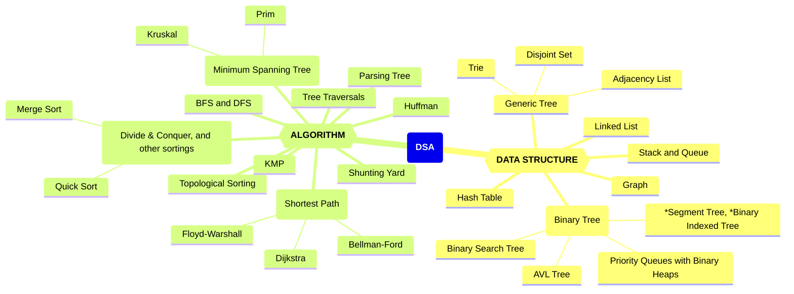
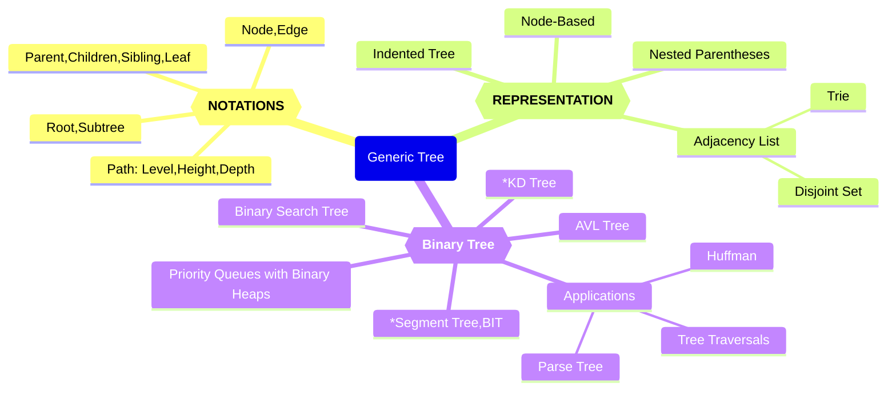
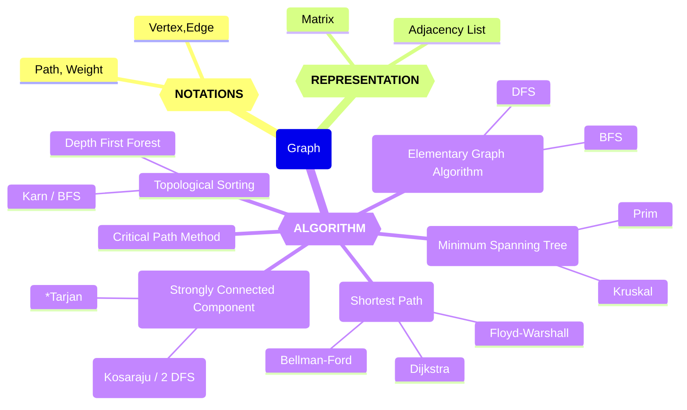

# 数据结构与算法知识体系（DSA）

*Updated 2025-12-22 13:16 GMT+8*  
*Compiled by Hongfei Yan (2025 Spring)*    


> 机考时间：第16周周五上机，2025年12月26日 17:10-19:02, 在7号机房
>笔试时间：周一，2026年1月5日 18:30-20:30。<mark>笔试地点：二教107</mark>。
> 
>课程的总评规划如下：期末机考时长为 1 小时 52 分钟，共包含 6 道编程题。建议同学们力争在机考中取得 AC5 或 AC6 的成绩，以确保获得“优秀”评级；若仅达到 AC0，笔试成绩满分，总评可以 84 分。
> 
> 
>
> 机考提示信息：
>
> 2025年12月数算（2025fall-cs201: DS Algo）课程期末上机考试。
>请独立完成，不能通讯，如：不能使用微信、邮件、QQ等工具。
> 考试期间，请同学只访问OJ，不能访问其他网站，不要查看OJ考试之前自己提交的代码。
>考试过程中允许可以带10张A4纸大小的cheat sheet，以及空白草稿纸。
> 题目编号前面的大写字母，相应表明是 Easy/Medium/Tough 级别。
> ————-
> 登录别人的账号即视为违纪甚至作弊。把自己的账号密码告诉别人，被别人登录，也视为违纪甚至作弊。如果考前别人用过你的账号，请立即修改密码。
> 
> 请把你的昵称改为 25nxxxxx, 后面部分是学号。http://cs101.openjudge.cn/mine
>有同学昵称24n, 23n, ..., 19n开始也是可以的，学号别错，才能找到你的成绩。
> 
> 

数据结构与算法（DSA，数算）的学习重点是树和图，及其涉及的各种核心算法。尽管栈和队列是基础的数据结构，且现代编程语言对其提供了直接支持，这使得我们可以方便地使用它们，但要真正掌握并高效利用这些结构，仍需深入理解其内部原理及适用场景。此外，其他一些复杂而强大的数据结构如并查集、前缀树等，同样值得我们去学习和探索。

一旦掌握了基本的数据结构（如数组、矩阵）和基础算法（包括递归、搜索、动态规划、贪心算法等），你会发现《数据结构与算法》这门课程变得更加容易理解。该课程主要探讨线性结构和非线性结构（如树和图）。其中：  

- **线性结构**可以视为数组概念的延伸，而数组本质上是一种隐式的链表。  
- **树**尤其是二叉树，通常使用递归来实现各种操作；并查集也是基于递归思想的应用，字典树（Trie）则可以通过嵌套字典（`dict{dict}`）来构建。  
- **图**作为矩阵概念的一种扩展，既可以通过二维数组表示矩阵来模拟，也可以用邻接表的形式（如`dict{list}`）来表示更复杂的图结构。

通过练习这些经典题目，可以帮助同步不同进度学生的学习步伐，还能有效提高解决实际问题的能力，并为进一步深入学习数据结构和算法提供必要的准备。  
例如，在《计算概论》阶段如果已经掌握了双指针技术，那么在《数据结构与算法》课程中遇到链表结构时，快慢指针的概念就会变得容易理解。同样地，掌握了递归思想后，并查集的实现也会更加直观。对于嵌套使用基本数据结构有了深入了解之后，构建字典树（Trie）以及图的表示方法（如邻接表dict{list}或邻接矩阵形式的二维数组）也将变得顺理成章。  
此外，搜索算法中的广度优先搜索（BFS）和深度优先搜索（DFS）是解决许多问题的基础。当你熟悉了BFS的应用场景后，将其应用于树结构中就成为了按层次遍历的有效工具。而一旦掌握了动态规划（DP），将这种思维方式扩展到树形结构上，即树形DP，也仅仅是遍历树的同时应用动态规划思想的过程。  
所以数算比计概简单，如果计概投入时间少，需要刷力扣热题100补足。https://leetcode.cn/studyplan/top-100-liked/  


<center>图1 数据结构与算法、计算概论课程内容覆盖知识点</center>


图1左侧为**数据结构**（Data Structure），右侧为**算法**（Algorithm），二者结合构成了 DSA 的核心内容。


## 一 、数据结构分类


### 1. 基础数据结构

- **栈（Stack）**：后进先出（LIFO），用于表达式求值、括号匹配等
- **队列（Queue）**：先进先出（FIFO）；包括双端队列（Deque）
- **哈希表（Hash Table / Dictionary / Map）**：常数时间插入/查询
- **链表（Linked List）**：单链表、双向链表、循环链表
- **数组（Array）**：支持随机访问
  - 前缀和 / 差分数组：用于区间求和/更新
- **字符串（String）**：特殊线性结构，支持哈希、匹配、变形等操作

---


### 2. 树结构

#### 🌳 通用树（General Tree）

- 节点、边、根、子树、父/子/兄弟节点、叶子节点
- 表示法：嵌套括号、缩进式、邻接表

#### 🌲 二叉树（Binary Tree）

- 遍历：先序、中序、后序、层序
- 常见树：
  - **解析树**（表达式计算）
  - **霍夫曼树**（最优前缀编码）
  - **优先队列**（基于堆实现）
  - **二叉搜索树（BST）**、AVL 自平衡树
  - *线段树（Segment Tree）
  - *树状数组（Fenwick Tree / Binary Indexed Tree）


---

### 3. 图结构（Graph）

- 顶点、边、路径、环、连通性、权重
- 表示方式：邻接矩阵、邻接表


---

## 二、 算法分类

### 1. 基础算法技巧

- 滑动窗口 & 双指针：子数组/子串枚举与优化
- 二分算法：查找 / 二分答案（最大化最小值 / 最小化最大值 ）
- 单调栈 & 单调队列：最近较大/较小元素、区间维护
- 辅助栈/队列：如最小栈、双栈实现队列
- 链表技巧：快慢指针


---

### 2. 经典算法思想

- 分治算法（Divide & Conquer）：快速排序、归并排序
- 动态规划（DP）：背包、树形、滚动数组优化用于压缩 DP 空间等
- 贪心算法：构造法、区间调度、反悔贪心
- 回溯与剪枝：组合、排列、子集、N 皇后、数独等
- 数学类：卡特兰数、同余等
- 表达式求值：
  - 调度场算法（Shunting Yard）
  - 逆波兰表达式（RPN）


---

### 3. 字符串算法

- KMP 算法：字符串匹配
- *Manacher 算法：最长回文子串
- 字符串哈希：双模哈希

---

### 4. 图论算法

- 图遍历：DFS / BFS（迷宫、连通块、染色等）
- 最短路径：
  - Dijkstra（贪心）
  - Bellman-Ford（可负权）
  - Floyd-Warshall（多源最短路径）
- 拓扑排序（DAG）
- 最小生成树：
  - Kruskal（并查集）、Prim（堆优化）
- 并查集（Union-Find）：路径压缩、连通性维护
- 强连通分量（SCC）：Kosaraju/ 2 DFS、*Tarjan


---

### 5. 树上算法

- LCA（最近公共祖先）：DFS + 递归（朴素法）
- 树的直径：DFS 
- 树上 DP


图2是数算内容汇总知识图谱。因为树、图的概念和相应算法较多，单独给出了树和图的知识图谱。

图3是树的知识图谱，描述了树的基本概念，到具体应用的各个方面。

图4是图的知识图谱，聚焦于图的基本概念、表示方法及其相关算法。

希望这种组织方式有助于清晰地理解各个知识点之间的关系，从而更加系统地学习数据结构与算法。




<center>图2 数算知识图谱</center>




<center>图3 树的知识图谱</center>




<center>图4 图的知识图谱</center>


我们班机考为主，`cs201数算 2025fall每日选做` 有193个题目，https://github.com/GMyhf/2025fall-cs201/blob/main/DSA_problem_list_at_2025fall.md


## 三、课件

课件网址 https://github.com/GMyhf/2025fall-cs201，下面只列出考试范围内的课件，大语言模型相关课件也可以在线查阅。

20250908_DSA_week1_VM_Shell_LLMs.md 虚拟机与大语言模型

20250915_DSA_week2_OOP.md	面向对象编程

20250922_binarySearch_RE_OOP_recursion.md 二分、正则表达式等

20250929_DSA_week4-5_timeComplexity_linearStructure.md	时间复杂度、排序、线性结构

20251020_week7-10_tree.md	树

20251117_week11-14_graph.md	图

20251215_HashTable_KMP.md	散列表、KMP

​	20251215_week15_outline.md

<mark>DSA_problem_list_at_2025fall.md	每日选做题目</mark>

20251222_DSA_week16_mindmap.md	数算知识体系（本文件）


两个主要的题解：

https://github.com/GMyhf/2024spring-cs201/blob/main/2024spring_dsa_problems.md

https://github.com/GMyhf/2024fall-cs101/blob/main/2024fall_LeetCode_problems.md

题解在
[dsa_problems](https://github.com/GMyhf/2024spring-cs201/blob/main/2024spring_dsa_problems.md),
[cs101.openjudge.cn_problems](https://github.com/GMyhf/2020fall-cs101/blob/main/2020fall_cs101.openjudge.cn_problems.md),
[Codeforces_problems](https://github.com/GMyhf/2020fall-cs101/blob/main/2020fall_Codeforces_problems.md),
[sunnywhy_problems](https://github.com/GMyhf/2024spring-cs201/blob/main/sunnywhy_problems.md),
[LeetCode_problems1](https://github.com/GMyhf/2024fall-cs101/blob/main/2024fall_LeetCode_problems.md)
[LeetCode_problems2](https://github.com/GMyhf/2024fall-cs101/blob/main/2024fall_LeetCode_tough_problems.md)


## 四、必须掌握题目

### 4.1 从每日选做中挑了一些重点需要掌握的题目

| 问题编号与名称                   | 标签              | 难度   | 链接                                      |
| -------------------------------- | ----------------- | ------ | ----------------------------------------- |
| 04089:电话号码                   | Trie              | Medium | http://cs101.openjudge.cn/practice/04089/ |
| 20106:走山路                     | Dijkstra          | Medium | http://cs101.openjudge.cn/practice/20106/ |
| 09202: 舰队、海域出击！          | Topological order | Medium | http://cs101.openjudge.cn/practice/09202/ |
| 05442: 兔子与星空                | MST               | Medium | http://cs101.openjudge.cn/practice/05442/ |
| 27635:判断无向图是否连通有无回路 | dfs, union-find   | Medium | http://cs101.openjudge.cn/practice/27635/ |
| 28046: 词梯                      | bfs               | Tough  | http://cs101.openjudge.cn/practice/28046/ |
| 04123: 马走日                    | backtracking      | Medium | http://cs101.openjudge.cn/practice/04123  |
| 02524: 宗教信仰                  | dsu               | Medium | http://cs101.openjudge.cn/practice/02524/ |
| 04078: 实现堆结构                | heap              | Medium | http://cs101.openjudge.cn/practice/04078/ |
| 22158: 根据二叉树前中序序列建树  | tree              | Medium | http://cs101.openjudge.cn/practice/22158/ |
| 24750: 根据二叉树中后序序列建树  | tree              | Medium | http://cs101.openjudge.cn/practice/24750/ |
| 24591:中序表达式转后序表达式     | stack             | Tough  | http://cs101.openjudge.cn/practice/24591/ |
| 03704: 括号匹配问题              | stack             | Easy   | http://cs101.openjudge.cn/practice/03704  |
| 02299: Ultra-QuickSort           | 归并排序          | Tough  | http://cs101.openjudge.cn/practice/02299/ |
| 08210:河中跳房子                 | Binary search     | Medium | http://cs101.openjudge.cn/practice/08210  |
| 27256: 当前队列中位数            | 双heap            | Tough  | http://cs101.openjudge.cn/practice/27256/ |


### 4.2 其他平行班：数算B必会简单题

Updated 0020 GMT+8 Jun 4, 2024

2024 spring, Complied by Hongfei Yan


取自gw班，http://dsbpython.openjudge.cn/easyprbs/


| 题目                            | tags             |
| ------------------------------- | ---------------- |
| 001: PKU版爱消除                | stack            |
| 002: 检测括号嵌套               | stack            |
| 003: 我想完成数算作业：代码     | disjoint set     |
| 20169: 排队                     | disjoint set     |
| 24744: 想要插队的Y君            | Linked List      |
| 27638: 求二叉树的高度和叶子数目 | tree             |
| 007: 深度优先遍历一个无向图     | dfs              |
| 22508: 最小奖金方案             | topological sort |


#### 001: PKU版爱消除

stack, http://dsbpython.openjudge.cn/easyprbs/001/

你有⼀个字符串S，⼤小写区分，⼀旦⾥⾯出现连续的PKU三个字符，就会消除。问最终稳定下来以后，这个字符串是什么样的？

输入

⼀⾏,⼀个字符串S，表⽰消除前的字符串。
字符串S的⻓度不超过100000，且只包含⼤小写字⺟。

输出

⼀⾏,⼀个字符串T，表⽰消除后的稳定字符串

样例输入

```
TopSchoolPPKPPKUKUUPKUku
```

样例输出

```
TopSchoolPku
```

提示

请注意看样例。PKU消除后导致出现连续PKU，还要继续消除
比如APKPKUUB，消除中间PKU后，又得到PKU，就接着消除得到AB
此题用栈解决

来源

Chen Jiali


```python
s = input()
stack = []
for c in s:
    if c == "U":
        if len(stack) >= 2 and stack[-1] == "K" and stack[-2] == "P":
            stack.pop()
            stack.pop()
        else:
            stack.append(c)
    else:
        stack.append(c)
print("".join(stack))
```


#### 002: 检测括号嵌套

stack, http://dsbpython.openjudge.cn/easyprbs/002/

字符串中可能有3种成对的括号，"( )"、"[ ]"、"{}"。请判断字符串的括号是否都正确配对以及有无括号嵌套。无括号也算正确配对。括号交叉算不正确配对，例如"1234[78)ab]"就不算正确配对。一对括号被包含在另一对括号里面，例如"12(ab[8])"就算括号嵌套。括号嵌套不影响配对的正确性。 给定一个字符串: 如果括号没有正确配对，则输出 "ERROR" 如果正确配对了，且有括号嵌套现象，则输出"YES" 如果正确配对了，但是没有括号嵌套现象，则输出"NO"   

输入

一个字符串，长度不超过5000,仅由 ( ) [ ] { } 和小写英文字母以及数字构成

输出

根据实际情况输出 ERROR, YES 或NO

样例输入

```
样例1:
[](){}
样例2:
[(a)]bv[]
样例3:
[[(])]{}
```

样例输出

```
样例1:
NO
样例2:
YES
样例3:
ERROR
```


```python
def check_brackets(s):
    stack = []
    nested = False
    pairs = {')': '(', ']': '[', '}': '{'}
    for ch in s:
        if ch in pairs.values():
            stack.append(ch)
        elif ch in pairs.keys():
            if not stack or stack.pop() != pairs[ch]:
                return "ERROR"
            if stack:
                nested = True
    if stack:
        return "ERROR"
    return "YES" if nested else "NO"

s = input()
print(check_brackets(s))
```


#### 003: 我想完成数算作业：代码

dsu, http://dsbpython.openjudge.cn/easyprbs/003/

当卷王小D睡前意识到室友们每天熬夜吐槽的是自己也选了的课时，他距离早八随堂交的ddl只剩下了不到4小时。已经debug一晚上无果的小D有心要分无力做题，于是决定直接抄一份室友的作业完事。万万没想到，他们作业里完全一致的错误，引发了一场全面的作业查重……

假设a和b作业雷同，b和c作业雷同，则a和c作业雷同。所有抄袭现象都会被发现，且雷同的作业只有一份独立完成的原版，请输出独立完成作业的人数

**输入**

第一行输入两个正整数表示班上的人数n与总比对数m，接下来m行每行均为两个1-n中的整数i和j，表明第i个同学与第j个同学的作业雷同。

**输出**

独立完成作业的人数

样例输入

```
3 2
1 2
1 3
样例2：
4 2
2 4
1 3
```

样例输出

```
样例1：
1
样例2:
2
```


```python
def find(parent, i):
    if parent[i] != i:
        parent[i] = find(parent, parent[i])
    return parent[i]

def union(parent, x, y):
    xroot = find(parent, x)
    yroot = find(parent, y)
    if xroot != yroot:
        parent[xroot] = yroot

n, m = map(int, input().split())
parent = list(range(n + 1))
for _ in range(m):
    i, j = map(int, input().split())
    union(parent, i, j)

count = sum(i == parent[i] for i in range(1, n + 1))
print(count)
```


#### 20169: 排队（简单dsu）

dsu, http://cs101.openjudge.cn/practice/20169/

操场上有好多好多同学在玩耍，体育老师冲了过来，要求他们排队。同学们纪律实在太散漫了，老师不得不来手动整队：
"A，你站在B的后面。" 
"C，你站在D的后面。"
"B，你站在D的后面。哦，去D队伍的最后面。" 

更形式化地，初始时刻，操场上有 n 位同学，自成一列。每次操作，老师的指令是 "x y"，表示 x 所在的队列排到 y 所在的队列的后面，即 x 的队首排在 y 的队尾的后面。（如果 x 与 y 已经在同一队列，请忽略该指令） 最终的队列数量远远小于 n，老师很满意。请你输出最终时刻每位同学所在队列的队首（排头），老师想记录每位同学的排头，方便找人。

**输入**

第一行一个整数 T (T≤5)，表示测试数据组数。 接下来 T 组测试数据，对于每组数据，第一行两个整数 n 和 m (n,m≤30000)，紧跟着 m 行每行两个整数 
x 和 y (1≤x,y≤n)。

**输出**

共 T 行。 每行 n 个整数，表示每位同学的排头。

样例输入

```
2
4 2
1 2
3 4
5 4
1 2
2 3
4 5
1 3
```

样例输出

```
2 2 4 4
3 3 3 5 5
```


```python
def getRoot(a):
    if parent[a] != a:
        parent[a] = getRoot(parent[a])
    return parent[a]


def merge(a, b):
    pa = getRoot(a)
    pb = getRoot(b)
    if pa != pb:
        parent[pa] = parent[pb]


t = int(input())
for i in range(t):
    n, m = map(int, input().split())
    parent = [i for i in range(n + 10)]
    for i in range(m):
        x, y = map(int, input().split())
        merge(x, y)
    for i in range(1, n + 1):
        print(getRoot(i), end=" ")
    # 注意，一定不能写成 print(parent[i],end= " ")
    # 因为只有执行路径压缩getRoot(i)以后，parent[i]才会是i的树根
    print()
```


#### 005: 想要插队的Y君

linked list, http://dsbpython.openjudge.cn/easyprbs/005/

很遗憾，一意孤行的Y君没有理会你告诉他的饮食计划并很快吃完了他的粮食储备。
但好在他捡到了一张校园卡，凭这个他可以偷偷混入领取物资的队伍。
为了不被志愿者察觉自己是只猫，他想要插到队伍的最中央。（插入后若有偶数个元素则选取靠后的位置）
于是他又找到了你，希望你能帮他修改志愿者写好的代码，在发放顺序的中间加上他的学号6。
你虽然不理解志愿者为什么要用链表来写这份代码，但为了不被发现只得在此基础上进行修改：

```
class Node:
	def __init__(self, data, next=None):
		self.data, self.next = data, next

class LinkList:
	def __init__(self):
		self.head = None

	def initList(self, data):
		self.head = Node(data[0])
		p = self.head
		for i in data[1:]:
			node = Node(i)
			p.next = node
			p = p.next

	def insertCat(self):
// 在此处补充你的代码
########            
	def printLk(self):
		p = self.head
		while p:
			print(p.data, end=" ")
			p = p.next
		print()

lst = list(map(int,input().split()))
lkList = LinkList()
lkList.initList(lst)
lkList.insertCat()
lkList.printLk()
```

输入

一行，若干个整数，组成一个链表。

输出

一行，在链表中间位置插入数字6后得到的新链表

样例输入

```
### 样例输入1
8 1 0 9 7 5
### 样例输入2
1 2 3
```

样例输出

```
### 样例输出1
8 1 0 6 9 7 5
### 样例输出2
1 2 6 3
```

来源

Lou Yuke


```python
class Node:
	def __init__(self, data, next=None):
		self.data, self.next = data, next

class LinkList:
	def __init__(self):
		self.head = None

	def initList(self, data):
		self.head = Node(data[0])
		p = self.head
		for i in data[1:]:
			node = Node(i)
			p.next = node
			p = p.next

	def insertCat(self):
#your code starts here
		ptr = self.head
		total = 0
		while ptr is not None:
			total += 1
			ptr = ptr.next
		if total % 2 == 0:
			pos = total // 2
		else:
			pos = total // 2 + 1
		ptr = self.head
		for i in range(pos-1):
			ptr = ptr.next
		nd = Node(6)
		nd.next = ptr.next
		ptr.next = nd
########            
	def printLk(self):
		p = self.head
		while p:
			print(p.data, end=" ")
			p = p.next
		print()

lst = list(map(int,input().split()))
lkList = LinkList()
lkList.initList(lst)
lkList.insertCat()
lkList.printLk()
```


#### 27638: 求二叉树的高度和叶子数目

tree, http://cs101.openjudge.cn/practice/27638/

给定一棵二叉树，求该二叉树的高度和叶子数目

二叉树高度定义：从根结点到叶结点依次经过的结点（含根、叶结点）形成树的一条路径，最长路径的结点数减1为树的高度。只有一个结点的二叉树，高度是0。

**输入**

第一行是一个整数 n，表示二叉树的结点个数。二叉树结点编号从 0 到 n-1。n ≤ 100。
接下来有 n 行，依次对应二叉树的编号为 0,1,2....n-1 的节点。
每行有两个整数，分别表示该节点的左儿子和右儿子的编号。如果第一个（第二个）数为-1则表示没有左（右）儿子

**输出**

在一行中输出2个整数，分别表示二叉树的高度和叶子结点个数。

样例输入

```
3
-1 -1
0 2
-1 -1
```

样例输出

```
1 2
```

来源

Guo Wei


<mark>由于输入无法分辨谁为根节点，所以写寻找根节点语句。</mark>

```python
class TreeNode:
    def __init__(self):
        self.left = None
        self.right = None

def tree_height(node):
    if node is None:
        return -1  # 根据定义，空树高度为-1
    return max(tree_height(node.left), tree_height(node.right)) + 1

def count_leaves(node):
    if node is None:
        return 0
    if node.left is None and node.right is None:
        return 1
    return count_leaves(node.left) + count_leaves(node.right)

n = int(input())  # 读取节点数量
nodes = [TreeNode() for _ in range(n)]
has_parent = [False] * n  # 用来标记节点是否有父节点

for i in range(n):
    left_index, right_index = map(int, input().split())
    if left_index != -1:
        nodes[i].left = nodes[left_index]
        has_parent[left_index] = True
    if right_index != -1:
        #print(right_index)
        nodes[i].right = nodes[right_index]
        has_parent[right_index] = True

# 寻找根节点，也就是没有父节点的节点
root_index = has_parent.index(False)
root = nodes[root_index]

# 计算高度和叶子节点数
height = tree_height(root)
leaves = count_leaves(root)

print(f"{height} {leaves}")
```


注意：需要找根节点

```python
class TreeNode:
    def __init__(self, val):
        self.val = val
        self.left = None
        self.right = None


def build_tree(node_descriptions):
    nodes = {i: TreeNode(i) for i in range(len(node_descriptions))}
    child_set = set()

    for i, (left, right) in enumerate(node_descriptions):
        if left != -1:
            nodes[i].left = nodes[left]
            child_set.add(left)
        if right != -1:
            nodes[i].right = nodes[right]
            child_set.add(right)

    # Root is the node that is not anyone's child
    root = next(node for node in nodes.values() if node.val not in child_set)
    return root


def tree_height_and_leaf_count(root):
    if not root:
        return 0, 0  # height is 0 for empty tree, no leaves

    def dfs(node):
        if not node:
            return -1, 0

        if not node.left and not node.right:
            return 0, 1

        left_height, left_leaves = dfs(node.left)
        right_height, right_leaves = dfs(node.right)

        current_height = 1 + max(left_height, right_height)
        current_leaves = left_leaves + right_leaves

        return current_height, current_leaves

    height, leaf_count = dfs(root)
    return height, leaf_count


n = int(input())
node_descriptions = [tuple(map(int, input().split())) for _ in range(n)]

root = build_tree(node_descriptions)
height, leaf_count = tree_height_and_leaf_count(root)

print(height, leaf_count)
```


```python
# 求二叉树的高度和叶子数目	2022-09-06 20:36:28
class BinaryTree:
    def __init__(self, data, left=None, right=None):
        self.data, self.left, self.right = data, left, right

    def addLeft(self, tree):  # tree是一个二叉树
        self.left = tree

    def addRight(self, tree):  # tree是一个二叉树
        self.right = tree

    def preorderTraversal(self, op):  # 前序遍历,对本题无用 op是函数，表示访问操作
        op(self)  # 访问根结点
        if self.left:  # 左子树不为空
            self.left.preorderTraversal(op)  # 遍历左子树
        if self.right:
            self.right.preorderTraversal(op)  # 遍历右子

    def inorderTraversal(self, op):  # 中序遍历， 对本题无用
        if self.left:
            self.left.inorderTraversal(op)
        op(self)
        if self.right:
            self.right.inorderTraversal(op)

    def postorderTraversal(self, op):  # 后序遍历， 对本题无用
        if self.left:
            self.left.postorderTraversal(op)
        if self.right:
            self.right.postorderTraversal(op)
        op(self)

    def bfsTraversal(self, op):  # 按层次遍历，对本题无用
        import collections
        dq = collections.deque()
        dq.append(self)
        while len(dq) > 0:
            nd = dq.popleft()
            op(nd)
            if nd.left:
                dq.append(nd.left)
            if nd.right:
                dq.append(nd.right)

    def countLevels(self):  # 算有多少层结点
        def count(root):
            if root is None:
                return 0
            return 1 + max(count(root.left), count(root.right))

        return count(self)

    def countLeaves(self):  # 算叶子数目
        def count(root):
            if root.left is None and root.right is None:
                return 1
            elif root.left is not None and root.right is None:
                return count(root.left)
            elif root.left is None and root.right is not None:
                return count(root.right)
            else:
                return count(root.right) + count(root.left)

        return count(self)

    def countWidth(self):  # 求宽度，对本题无用
        dt = {}

        def traversal(root, level):
            if root is None:
                return
            dt[level] = dt.get(level, 0) + 1
            traversal(root.left, level + 1)
            traversal(root.right, level + 1)

        traversal(self, 0)
        width = 0
        for x in dt.items():
            width = max(width, x[1])
        return width


def buildTree(n):
    nodes = [BinaryTree(None) for i in range(n)]
    isRoot = [True] * n
    # 树描述： 结点编号从0开始
    # 1 2
    # -1 -1
    # -1 -1
    for i in range(n):
        L, R = map(int, input().split())
        nd = i
        nodes[nd].data = nd
        if L != -1:
            nodes[nd].left = nodes[L]
            isRoot[L] = False
        if R != -1:
            nodes[nd].right = nodes[R]
            isRoot[R] = False
    for i in range(n):
        if isRoot[i]:
            return nodes[i]
    return None


n = int(input())
tree = buildTree(n)
print(tree.countLevels() - 1, tree.countLeaves())

```


#### 007: 深度优先遍历一个无向图

dfs, http://dsbpython.openjudge.cn/easyprbs/007/

输出无向图深度优先遍历序列

 **输入**

第一行是整数 n 和 m (0 < n ≤16)，表示无向图有 n 个顶点，m 条边，顶点编号 0 到 n-1。接下来 m 行，每行两个整数 a,b，表示顶点 a,b 之间有一条边。

**输出**

任意一个深度优先遍历序列

样例输入

```
9 9
0 1
0 2
3 0
2 1
1 5
1 4
4 5
6 3
8 7
```

样例输出

```
0 1 2 4 5 3 6 8 7
```

提示

题目需要Special Judge。所以输出错误答案也可能导致Runtime Error

来源

Guo Wei


```python
def dfs(graph, visited, node):
    visited[node] = True
    print(node, end=" ")

    for neighbor in graph[node]:
        if not visited[neighbor]:
            dfs(graph, visited, neighbor)

def main():
    n, m = map(int, input().split())
    graph = [[] for _ in range(n)]
    visited = [False] * n

    for _ in range(m):
        a, b = map(int, input().split())
        graph[a].append(b)
        graph[b].append(a)

    for i in range(n):
        if not visited[i]:
            dfs(graph, visited, i)

if __name__ == "__main__":
    main()
```


```python
def dfsTravel(G,op): #G是邻接表
	def dfs(v):
		visited[v] = True
		op(v)
		for u in G[v]:
			if not visited[u]:
				dfs(u)
	n = len(G)  # 顶点数目
	visited = [False for i in range(n)]
	for i in range(n):  # 顶点编号0到n-1
		if not visited[i]:
			dfs(i)

n,m = map(int,input().split())
G = [[] for i in range(n)]
for i in range(m):
	s,e = map(int,input().split())
	G[s].append(e)
	G[e].append(s)
dfsTravel(G,lambda x:print(x,end = " "))
```


#### 22508: 最小奖金方案

toplogical order, http://cs101.openjudge.cn/practice/22508/

现在有n个队伍参加了比赛，他们进行了 m 次 PK。现在赛事方需要给他们颁奖（奖金为整数），已知参加比赛就可获得 100 元，由于比赛双方会比较自己的奖金，所以获胜方的奖金一定要比败方奖金高。请问赛事方要准备的最小奖金为多少？奖金数额一定是整数。

**输入**

一组数据，第一行是两个整数 n (1 ≤ n ≤ 1000) 和 m (0 ≤ m ≤ 2000)，分别代表 n 个队伍和 m 次pk，队伍编号从0 到 n-1。接下来 m 行是 pk 信息，具体信息 a, b，代表编号为 a 的队伍打败了编号为 b 的队伍。
输入保证队伍之间的 pk 战胜关系不会形成有向环

**输出**

给出最小奖金w

样例输入

```
5 6
1 0
2 0
3 0
4 1
4 2
4 3
```

样例输出

```
505
```

来源

陈鑫


```python
import collections
n,m = map(int,input().split())
G = [[] for i in range(n)]
award = [0 for i in range(n)]
inDegree = [0 for i in range(n)]

for i in range(m):
	a,b = map(int,input().split())
	G[b].append(a)
	inDegree[a] += 1
q = collections.deque()
for i in range(n):
	if inDegree[i] == 0:
		q.append(i)
		award[i] = 100
while len(q) > 0:
	u = q.popleft()
	for v in G[u]:
		inDegree[v] -= 1
		award[v] = max(award[v],award[u] + 1)
		if inDegree[v] == 0:
			q.append(v)
total = sum(award)
print(total)
```


## 五、每日选做题目

网址，https://github.com/GMyhf/2025fall-cs201/blob/main/DSA_problem_list_at_2025fall.md


### 拓扑排序
**01094: Sorting It All Out**

topological order, http://cs101.openjudge.cn/practice/01094/

An ascending sorted sequence of distinct values is one in which some form of a less-than operator is used to order the elements from smallest to largest. For example, the sorted sequence A, B, C, D implies that A < B, B < C and C < D. in this problem, we will give you a set of relations of the form A < B and ask you to determine whether a sorted order has been specified or not. 

**输入**

Input consists of multiple problem instances. Each instance starts with a line containing two positive integers n and m. the first value indicated the number of objects to sort, where 2 <= n <= 26. The objects to be sorted will be the first n characters of the uppercase alphabet. The second value m indicates the number of relations of the form A < B which will be given in this problem instance. Next will be m lines, each containing one such relation consisting of three characters: an uppercase letter, the character "<" and a second uppercase letter. No letter will be outside the range of the first n letters of the alphabet. Values of n = m = 0 indicate end of input.

**输出**

For each problem instance, output consists of one line. This line should be one of the following three:

Sorted sequence determined after xxx relations: yyy...y.
Sorted sequence cannot be determined.
Inconsistency found after xxx relations.

where xxx is the number of relations processed at the time either a sorted sequence is determined or an inconsistency is found, whichever comes first, and yyy...y is the sorted, ascending sequence.

样例输入

```
4 6
A<B
A<C
B<C
C<D
B<D
A<B
3 2
A<B
B<A
26 1
A<Z
0 0
```

样例输出

```
Sorted sequence determined after 4 relations: ABCD.
Inconsistency found after 2 relations.
Sorted sequence cannot be determined.
```

来源

East Central North America 2001


- 题面：给定n个大写字母和m个"A<B"形式的关系，判断是否能确定唯一排序序列，或发现矛盾。
- 思路：增量式拓扑排序，每次添加关系后检测入度变化，若存在多个入度0节点则序列不唯一，出现环则矛盾。

```python
#23n2310307206胡景博
from collections import deque
def topo_sort(graph):
    in_degree = {u:0 for u in graph}
    for u in graph:
        for v in graph[u]:
            in_degree[v] += 1
    q = deque([u for u in in_degree if in_degree[u] == 0])
    topo_order = [];flag = True
    while q:
        if len(q) > 1:
            flag = False#topo_sort不唯一确定
        u = q.popleft()
        topo_order.append(u)
        for v in graph[u]:
            in_degree[v] -= 1
            if in_degree[v] == 0:
                q.append(v)
    if len(topo_order) != len(graph): return 0
    return topo_order if flag else None
while True:
    n,m = map(int,input().split())
    if n == 0: break
    graph = {chr(x+65):[] for x in range(n)}
    edges = [tuple(input().split('<')) for _ in range(m)]
    for i in range(m):
        a,b = edges[i]
        graph[a].append(b)
        t = topo_sort(graph)
        if t:
            s = ''.join(t)
            print("Sorted sequence determined after {} relations: {}.".format(i+1,s))
            break
        elif t == 0:
            print("Inconsistency found after {} relations.".format(i+1))
            break
    else:
        print("Sorted sequence cannot be determined.")

```


**T1857.有向图中最大颜色值**，  https://leetcode.cn/problems/largest-color-value-in-a-directed-graph/

给你一个 **有向图** ，它含有 `n` 个节点和 `m` 条边。节点编号从 `0` 到 `n - 1` 。

给你一个字符串 `colors` ，其中 `colors[i]` 是小写英文字母，表示图中第 `i` 个节点的 **颜色** （下标从 **0** 开始）。同时给你一个二维数组 `edges` ，其中 `edges[j] = [aj, bj]` 表示从节点 `aj` 到节点 `bj` 有一条 **有向边** 。

图中一条有效 **路径** 是一个点序列 `x1 -> x2 -> x3 -> ... -> xk` ，对于所有 `1 <= i < k` ，从 `xi` 到 `xi+1` 在图中有一条有向边。路径的 **颜色值** 是路径中 **出现次数最多** 颜色的节点数目。

请你返回给定图中有效路径里面的 **最大颜色值** **。**如果图中含有环，请返回 `-1` 。

 

**示例 1：**


```
输入：colors = "abaca", edges = [[0,1],[0,2],[2,3],[3,4]]
输出：3
解释：路径 0 -> 2 -> 3 -> 4 含有 3 个颜色为 "a" 的节点（上图中的红色节点）。
```

**示例 2：**


```
输入：colors = "a", edges = [[0,0]]
输出：-1
解释：从 0 到 0 有一个环。
```

 

**提示：**

- `n == colors.length`
- `m == edges.length`
- `1 <= n <= 10^5`
- `0 <= m <= 10^5`
- `colors` 只含有小写英文字母。
- `0 <= aj, bj < n`


题面：在有向图中寻找路径使得节点颜色出现次数最大值最大  

思路：拓扑排序+动态规划，维护每个节点各颜色出现次数的最大值

```python
from collections import deque
from typing import List

class Solution:
    def largestPathValue(self, colors: str, edges: List[List[int]]) -> int:
        n = len(colors)
        # 1. 构建邻接表和入度数组
        adj = [[] for _ in range(n)]
        indegree = [0] * n
        
        for u, v in edges:
            adj[u].append(v)
            indegree[v] += 1
        
        # 2. 初始化队列，将所有入度为0的节点加入
        q = deque([i for i in range(n) if indegree[i] == 0])
        
        # 3. DP 数组: dp[i][j] 表示以节点 i 结尾的路径中，颜色 j 出现的最大次数
        # 颜色映射: 'a' -> 0, ..., 'z' -> 25
        dp = [[0] * 26 for _ in range(n)]
        
        processed_count = 0
        ans = 0
        
        while q:
            u = q.popleft()
            processed_count += 1
            
            # 处理当前节点 u 的颜色
            u_color = ord(colors[u]) - ord('a')
            dp[u][u_color] += 1
            
            # 更新全局最大值
            ans = max(ans, dp[u][u_color])
            
            # 遍历邻居节点
            for v in adj[u]:
                # 状态转移：将 u 的所有颜色状态传递给 v
                # 因为只有 26 种颜色，这个循环是常数级的，不会超时
                for c in range(26):
                    if dp[u][c] > dp[v][c]:
                        dp[v][c] = dp[u][c]
                
                # 拓扑排序逻辑
                indegree[v] -= 1
                if indegree[v] == 0:
                    q.append(v)
        
        # 4. 判断是否有环
        if processed_count < n:
            return -1
            
        return ans
```


210.课程表II， https://leetcode.cn/problems/course-schedule-ii/

22508:最小奖金方案， http://cs101.openjudge.cn/practice/22508/

09202: 舰队、海域出击！http://cs101.openjudge.cn/practice/09202/

207.课程表，https://leetcode.cn/problems/course-schedule/


### 动态规划DP
**M337.打家劫舍III**，

树形dp, https://leetcode.cn/problems/house-robber-iii/

小偷又发现了一个新的可行窃的地区。这个地区只有一个入口，我们称之为 `root` 。

除了 `root` 之外，每栋房子有且只有一个“父“房子与之相连。一番侦察之后，聪明的小偷意识到“这个地方的所有房屋的排列类似于一棵二叉树”。 如果 **两个直接相连的房子在同一天晚上被打劫** ，房屋将自动报警。

给定二叉树的 `root` 。返回 ***在不触动警报的情况下** ，小偷能够盗取的最高金额* 。

 

**示例 1:**


```
输入: root = [3,2,3,null,3,null,1]
输出: 7 
解释: 小偷一晚能够盗取的最高金额 3 + 3 + 1 = 7
```

**示例 2:**


```
输入: root = [3,4,5,1,3,null,1]
输出: 9
解释: 小偷一晚能够盗取的最高金额 4 + 5 = 9
```

 

**提示：**


- 树的节点数在 `[1, 10^4]` 范围内
- `0 <= Node.val <= 10^4`


- 题面：在二叉树中选择不相邻节点求最大和  
- 思路：树形DP，记录每个节点偷/不偷两种状态的最大值

视频讲解，https://www.bilibili.com/video/BV1vu4y1f7dn/


```python
# Definition for a binary tree node.
# class TreeNode:
#     def __init__(self, val=0, left=None, right=None):
#         self.val = val
#         self.left = left
#         self.right = right
class Solution:
    def rob(self, root: Optional[TreeNode]) -> int:
        def dfs(node):
            if node is None:
                return 0,0

            l_rob, l_not_rob = dfs(node.left)
            r_rob, r_not_rob = dfs(node.right)
            choose = node.val + l_not_rob + r_not_rob
            not_choose = max(l_rob, l_not_rob) + max(r_rob, r_not_rob)
        
            return choose, not_choose
        
        return max(dfs(root))
```


24637:宝藏二叉树， 

树形dp, http://cs101.openjudge.cn/practice/24637/


45.跳跃游戏II, https://leetcode.cn/problems/jump-game-ii/

01159: Palindrome， http://cs101.openjudge.cn/practice/01159/

**M542.01 矩阵，**

bfs, dp, https://leetcode-cn.com/problems/01-matrix/

给定一个由 `0` 和 `1` 组成的矩阵 `mat` ，请输出一个大小相同的矩阵，其中每一个格子是 `mat` 中对应位置元素到最近的 `0` 的距离。

两个相邻元素间的距离为 `1` 。

 

**示例 1：**


```
输入：mat = [[0,0,0],[0,1,0],[0,0,0]]
输出：[[0,0,0],[0,1,0],[0,0,0]]
```

**示例 2：**


```
输入：mat = [[0,0,0],[0,1,0],[1,1,1]]
输出：[[0,0,0],[0,1,0],[1,2,1]]
```

 

**提示：**

- `m == mat.length`
- `n == mat[i].length`
- `1 <= m, n <= 10^4`
- `1 <= m * n <= 10^4`
- `mat[i][j] is either 0 or 1.`
- `mat` 中至少有一个 `0 `

 

124ms，击败64.56%

```python
from typing import List
from collections import deque

class Solution:
    def updateMatrix(self, mat: List[List[int]]) -> List[List[int]]:
        m, n = len(mat), len(mat[0])
        dp = [[float('inf')] * n for _ in range(m)]
        queue = deque()

        # 初始化，把所有 0 加入队列，结构为 (dist, i, j)
        for i in range(m):
            for j in range(n):
                if mat[i][j] == 0:
                    dp[i][j] = 0
                    queue.append((0, i, j))  # 明确带 dist，便于调试、阅读

        directions = [(-1,0), (1,0), (0,-1), (0,1)]

        while queue:
            dist, x, y = queue.popleft()

            # 如果当前距离比 dp 更大，说明已被更新（可选的剪枝）
            if dist > dp[x][y]:
                continue

            for dx, dy in directions:
                nx, ny = x + dx, y + dy
                if 0 <= nx < m and 0 <= ny < n:
                    if dp[nx][ny] > dist + 1:
                        dp[nx][ny] = dist + 1
                        queue.append((dp[nx][ny], nx, ny))  

        return dp

# 测试
if __name__ == "__main__":
    mat = [[0,0,0],[0,1,0],[1,1,1]]
    for row in Solution().updateMatrix(mat):
        print(row)

```


是 OJ01088:滑雪 的升级版。因为矩阵每个点的高度有更新，不能只用sort一次，需要使用heapq。

当路径代价不同、更新存在“早晚优先级”时，用堆有优势。否则 BFS 更快。

207ms，击败19.49%

```python
import heapq
from typing import List

class Solution:
    def updateMatrix(self, mat: List[List[int]]) -> List[List[int]]:
        m, n = len(mat), len(mat[0])
        dp = [[float('inf')] * n for _ in range(m)]
        heap = []

        # 初始化，所有的0加入到堆中
        for i in range(m):
            for j in range(n):
                if mat[i][j] == 0:
                    dp[i][j] = 0
                    heapq.heappush(heap, (0, i, j))  # (distance, x, y)

        # 定义四个方向的移动
        directions = [(0, 1), (0, -1), (1, 0), (-1, 0)]

        # 使用堆进行更新
        while heap:
            dist, x, y = heapq.heappop(heap)

            # 如果当前的距离大于 dp[x][y]，说明这个位置已经被更新过，不需要再次处理
            if dist > dp[x][y]:
                continue

            # 对当前点的四个方向进行处理
            for dx, dy in directions:
                nx, ny = x + dx, y + dy
                if 0 <= nx < m and 0 <= ny < n:
                    # 如果新位置的dp值可以更新（即发现更短的路径）
                    if dp[nx][ny] > dp[x][y] + 1:
                        dp[nx][ny] = dp[x][y] + 1
                        heapq.heappush(heap, (dp[nx][ny], nx, ny))

        return dp

# 测试用例
if __name__ == "__main__":
    mat = [[0,0,0],[0,1,0],[1,1,1]]
    print(Solution().updateMatrix(mat))
```


01088: 滑雪，http://cs101.openjudge.cn/practice/01088

121.买卖股票的最佳时机，https://leetcode.cn/problems/best-time-to-buy-and-sell-stock/

5.最长回文子串

dp, two pointers, Manacher，https://leetcode.cn/problems/longest-palindromic-substring/

1299.将每个元素替换为右侧最大元素，https://leetcode.cn/problems/replace-elements-with-greatest-element-on-right-side/


### 字符串 & 数学

**M3556.最大质数子字符串之和**

string, math, https://leetcode.cn/problems/sum-of-largest-prime-substrings/

给定一个字符串 `s`，找出可以由其 **子字符串** 组成的 **3个最大的不同质数** 的和。

返回这些质数的 **总和** ，如果少于 3 个不同的质数，则返回 **所有** 不同质数的和。

质数是大于 1 且只有两个因数的自然数：1和它本身。

**子字符串** 是字符串中的一个连续字符序列。 

**注意：**每个质数即使出现在 **多个** 子字符串中，也只能计算 **一次** 。此外，将子字符串转换为整数时，忽略任何前导零。

 

**示例 1：**

**输入：** s = "12234"

**输出：** 1469

**解释：**

- 由 `"12234"` 的子字符串形成的不同质数为 2 ，3 ，23 ，223 和 1223。
- 最大的 3 个质数是 1223、223 和 23。它们的和是 1469。

**示例 2：**

**输入：** s = "111"

**输出：** 11

**解释：**

- 由 `"111"` 的子字符串形成的不同质数是 11。
- 由于只有一个质数，所以结果是 11。

 

**提示：**

- `1 <= s.length <= 10`
- `s` 仅由数字组成。


```python
class Solution:
    def sumOfLargestPrimes(self, s: str) -> int:
        def is_prime(n: int) -> bool:
            if n < 2:
                return False
            for i in range(2, int(n**0.5) + 1):
                if n % i == 0:
                    return False
            return True

        primes = set()
        for left in range(len(s)):
            num = int(s[left])
            if is_prime(num):
                primes.add(num)
            for right in range(left + 1, len(s)):
                num = int(s[left:right + 1])

                if is_prime(num):
                    primes.add(num)

        primes = list(primes)
        primes.sort(reverse=True)

        return sum(primes[:3]) if len(primes) > 2 else sum(primes)

if __name__ == "__main__":
    sol = Solution()
    print(sol.sumOfLargestPrimes("12234"))
    print(sol.sumOfLargestPrimes("111"))
```


### 滑动窗口sliding window


2962.统计最大元素出现至少K次的子数组，https://leetcode.cn/problems/count-subarrays-where-max-element-appears-at-least-k-times/

2799.统计完全子数组的数目，https://leetcode.cn/problems/count-complete-subarrays-in-an-array/


### 单调栈Monotonic Stack

**T84.柱状图中最大的矩形，**https://leetcode.cn/problems/largest-rectangle-in-histogram/

给定 *n* 个非负整数，用来表示柱状图中各个柱子的高度。每个柱子彼此相邻，且宽度为 1 。

求在该柱状图中，能够勾勒出来的矩形的最大面积。

 

**示例 1:**


```
输入：heights = [2,1,5,6,2,3]
输出：10
解释：最大的矩形为图中红色区域，面积为 10
```

**示例 2：**


```
输入： heights = [2,4]
输出： 4
```

 

**提示：**

- `1 <= heights.length <=10^5`
- `0 <= heights[i] <= 10^4`


```python
from typing import List
class Solution:
    def largestRectangleArea(self, heights: List[int]) -> int:
        stack = []
        heights = [0] + heights + [0]
        res = 0
        for i in range(len(heights)):
            while stack and heights[i] < heights[stack[-1]]:
                h = heights[stack.pop()]
                w = i - stack[-1] - 1
                res = max(res, h * w)
            stack.append(i)
        return res

if __name__ == '__main__':
    s = Solution()
    print(s.largestRectangleArea([2,1,5,6,2,3]))
```

关键概念：

1. **单调栈**：
   - <mark>用栈来维护柱子的索引，并确保栈中的柱子高度是单调递增的。</mark>
   - 当遇到比栈顶柱子矮的柱子时，就意味着栈顶的柱子已经不能再扩展更大的矩形了，应该从栈中弹出这个柱子，计算以它为高度的矩形面积。
2. **为什么需要在 `heights` 前后加 0**：
   - 通过在 `heights` 数组的开始和结束分别加上 `0`，可以保证栈最终能清空，并且在所有柱子处理完后能够强制计算出最后一块矩形面积。
   - 这个“0”是为了处理栈中剩余的柱子（特别是最后一部分）。

栈操作：

- **栈中存储的是什么**：
  - `stack` 中存储的是柱子的 **索引**，而不是柱子的高度。这样可以通过 `heights[i]` 直接访问到柱子的高度。
- **计算矩形面积**：
  - 在栈顶元素出栈时，表示栈顶柱子所能组成的最大矩形已经结束，当前的矩形高度就是栈顶柱子的高度。
  - 宽度 `w` 的计算是当前索引 `i` 减去栈中的下一个元素索引（即 `stack[-1]`），再减去 1，因为栈中的元素代表了一个 **区间**。
  - 例如，如果 `stack[-1]` 是索引 `j`，那么这个矩形的宽度就是 `i - j - 1`。


### KMP

T01961: 前缀中的周期，http://cs101.openjudge.cn/practice/01961/

题意：给定一个长度为N的字符串S，对S的每一个前缀S[1~i]，如果它的最大循环次数大于1，则输出该前缀的长度和最大循环次数。

```python
'''
这是一个字符串匹配问题，通常使用KMP算法（Knuth-Morris-Pratt算法）来解决。
使用了 Knuth-Morris-Pratt 算法来寻找字符串的所有前缀，并检查它们是否由重复的子串组成，
如果是的话，就打印出前缀的长度和最大重复次数。
'''

# 得到字符串s的前缀值列表
def kmp_next(s):
  	# kmp算法计算最长相等前后缀
    next = [0] * len(s)
    j = 0
    for i in range(1, len(s)):
        while s[i] != s[j] and j > 0:
            j = next[j - 1]
        if s[i] == s[j]:
            j += 1
        next[i] = j
    return next


def main():
    case = 0
    while True:
        n = int(input().strip())
        if n == 0:
            break
        s = input().strip()
        case += 1
        print("Test case #{}".format(case))
        next = kmp_next(s)
        for i in range(2, len(s) + 1):
            k = i - next[i - 1]		# 可能的重复子串的长度
            if (i % k == 0) and i // k > 1:
                print(i, i // k)
        print()


if __name__ == "__main__":
    main()
```


### 栈Stack

3561.移除相邻字符，https://leetcode.cn/problems/resulting-string-after-adjacent-removals/

**T24591:中序表达式转后序表达式**，http://cs101.openjudge.cn/practice/24591/

<mark>Shunting Yard 算法的主要思想是使用两个栈（运算符栈和输出栈）来处理表达式的符号</mark>。算法按照运算符的优先级和结合性，将符号逐个处理并放置到正确的位置。最终，输出栈中的元素就是转换后的后缀表达式。

以下是 Shunting Yard 算法的基本步骤：

1. 初始化运算符栈和输出栈为空。
2. 从左到右遍历中缀表达式的每个符号。
   - 如果是操作数（数字），则将其添加到输出栈。
   - 如果是左括号，则将其推入运算符栈。
   - 如果是运算符：
     - 如果运算符的优先级大于运算符栈顶的运算符，或者运算符栈顶是左括号，则将当前运算符推入运算符栈。
     - 否则，将运算符栈顶的运算符弹出并添加到输出栈中，直到满足上述条件（或者运算符栈为空）。
     - 将当前运算符推入运算符栈。
   - 如果是右括号，则将运算符栈顶的运算符弹出并添加到输出栈中，直到遇到左括号。将左括号弹出但不添加到输出栈中。
3. 如果还有剩余的运算符在运算符栈中，将它们依次弹出并添加到输出栈中。
4. 输出栈中的元素就是转换后的后缀表达式。


<mark>接收浮点数，是number buffer技巧。</mark>

```python
def infix_to_postfix(expression):
    precedence = {'+':1, '-':1, '*':2, '/':2}
    stack = []
    postfix = []
    number = ''

    for char in expression:
        if char.isnumeric() or char == '.':
            number += char
        else:
            if number:
                num = float(number)
                postfix.append(int(num) if num.is_integer() else num)
                number = ''
            if char in '+-*/':
                while stack and stack[-1] in '+-*/' and precedence[char] <= precedence[stack[-1]]:
                    postfix.append(stack.pop())
                stack.append(char)
            elif char == '(':
                stack.append(char)
            elif char == ')':
                while stack and stack[-1] != '(':
                    postfix.append(stack.pop())
                stack.pop()

    if number:
        num = float(number)
        postfix.append(int(num) if num.is_integer() else num)

    while stack:
        postfix.append(stack.pop())

    return ' '.join(str(x) for x in postfix)

n = int(input())
for _ in range(n):
    expression = input()
    print(infix_to_postfix(expression))
```


接收数据，还可以用<mark>re处理</mark>。

```python
# 24591:中序表达式转后序表达式
# http://cs101.openjudge.cn/practice/24591/

def inp(s):
    #s=input().strip()
    import re
    s=re.split(r'([\(\)\+\-\*\/])',s)
    s=[item for item in s if item.strip()]
    return s

exp = "(3)*((3+4)*(2+3.5)/(4+5)) "
print(inp(exp))
```


sy295: 可能的出栈序列，https://sunnywhy.com/sfbj/7/1/295

22068:合法出栈序列，http://cs101.openjudge.cn/practice/22068/

02734: 十进制到八进制，http://cs101.openjudge.cn/practice/02734/

02694:波兰表达式，http://cs101.openjudge.cn/practice/02694/

150.逆波兰表达式求值，https://leetcode.cn/problems/evaluate-reverse-polish-notation/

20140:今日化学论文，http://cs101.openjudge.cn/practice/20140/

03704:扩号匹配问题，http://cs101.openjudge.cn/practice/03704/

394.字符串解码，https://leetcode.cn/problems/decode-string/


### 辅助栈

M155.最小栈，https://leetcode.cn/problems/min-stack/

OOP，辅助栈, https://leetcode.cn/problems/min-stack/

设计一个支持 `push` ，`pop` ，`top` 操作，并能在<mark>常数时间内检索到最小元素的栈</mark>。

实现 `MinStack` 类:

- `MinStack()` 初始化堆栈对象。
- `void push(int val)` 将元素val推入堆栈。
- `void pop()` 删除堆栈顶部的元素。
- `int top()` 获取堆栈顶部的元素。
- `int getMin()` 获取堆栈中的最小元素。

 

**示例 1:**

```
输入：
["MinStack","push","push","push","getMin","pop","top","getMin"]
[[],[-2],[0],[-3],[],[],[],[]]

输出：
[null,null,null,null,-3,null,0,-2]

解释：
MinStack minStack = new MinStack();
minStack.push(-2);
minStack.push(0);
minStack.push(-3);
minStack.getMin();   --> 返回 -3.
minStack.pop();
minStack.top();      --> 返回 0.
minStack.getMin();   --> 返回 -2.
```

 

**提示：**

- `-2^31 <= val <= 2^31 - 1`
- `pop`、`top` 和 `getMin` 操作总是在 **非空栈** 上调用
- `push`, `pop`, `top`, and `getMin`最多被调用 `3 * 10^4` 次


```python
class MinStack:

    def __init__(self):
        self.stack = []
        self.min_stack = []

    def push(self, val: int) -> None:
        self.stack.append(val)
        if not self.min_stack or val <= self.min_stack[-1]:
            self.min_stack.append(val)

    def pop(self) -> None:
        if self.stack:
            if self.stack[-1] == self.min_stack[-1]:
                self.min_stack.pop()
            self.stack.pop()

    def top(self) -> int:
        if self.stack:
            return self.stack[-1]

    def getMin(self) -> int:
        if self.min_stack:
            return self.min_stack[-1]

# Your MinStack object will be instantiated and called as such:
# obj = MinStack()
# obj.push(val)
# obj.pop()
# param_3 = obj.top()
# param_4 = obj.getMin()
```


### 队列queue

**E04067:回文数字**，http://cs101.openjudge.cn/practice/04067/

```python
from collections import deque

def is_palindrome(num):
    num_str = str(num)
    num_deque = deque(num_str)
    while len(num_deque) > 1:
        if num_deque.popleft() != num_deque.pop():
            return "NO"
    return "YES"

while True:
    try:
        num = int(input())
        print(is_palindrome(num))
    except EOFError:
        break
```


### 矩阵matrices

02659: Bomb Game, http://cs101.openjudge.cn/practice/02659/

18161:矩阵运算(先乘再加)，http://cs101.openjudge.cn/2025sp_routine/18161/

**M48.旋转图像**，https://leetcode.cn/problems/rotate-image/

给定一个 *n* × *n* 的二维矩阵 `matrix` 表示一个图像。请你将图像顺时针旋转 90 度。

你必须在**[ 原地](https://baike.baidu.com/item/原地算法)** 旋转图像，这意味着你需要直接修改输入的二维矩阵。**请不要** 使用另一个矩阵来旋转图像。

 

**示例 1：**


```
输入：matrix = [[1,2,3],[4,5,6],[7,8,9]]
输出：[[7,4,1],[8,5,2],[9,6,3]]
```

**示例 2：**


```
输入：matrix = [[5,1,9,11],[2,4,8,10],[13,3,6,7],[15,14,12,16]]
输出：[[15,13,2,5],[14,3,4,1],[12,6,8,9],[16,7,10,11]]
```

 

**提示：**

- `n == matrix.length == matrix[i].length`
- `1 <= n <= 20`
- `-1000 <= matrix[i][j] <= 1000`


```python
class Solution:
    def rotate(self, matrix: List[List[int]]) -> None:
        """
        Do not return anything, modify matrix in-place instead.
        """
        n = len(matrix)
        for i in range(n):  # 先转置矩阵
            for j in range(i, n):
                matrix[i][j], matrix[j][i] = matrix[j][i], matrix[i][j]
        for i in range(n):  # 再水平翻转矩阵
            matrix[i].reverse()
```


**M2906.构造乘积矩阵**

matrices, prefix sum，https://leetcode.cn/problems/construct-product-matrix/

给你一个下标从 **0** 开始、大小为 `n * m` 的二维整数矩阵 `grid` ，定义一个下标从 **0** 开始、大小为 `n * m` 的的二维矩阵 `p`。如果满足以下条件，则称 `p` 为 `grid` 的 **乘积矩阵** ：

- 对于每个元素 `p[i][j]` ，它的值等于除了 `grid[i][j]` 外所有元素的乘积。乘积对 `12345` 取余数。

返回 `grid` 的乘积矩阵。

 

**示例 1：**

```
输入：grid = [[1,2],[3,4]]
输出：[[24,12],[8,6]]
解释：p[0][0] = grid[0][1] * grid[1][0] * grid[1][1] = 2 * 3 * 4 = 24
p[0][1] = grid[0][0] * grid[1][0] * grid[1][1] = 1 * 3 * 4 = 12
p[1][0] = grid[0][0] * grid[0][1] * grid[1][1] = 1 * 2 * 4 = 8
p[1][1] = grid[0][0] * grid[0][1] * grid[1][0] = 1 * 2 * 3 = 6
所以答案是 [[24,12],[8,6]] 。
```

**示例 2：**

```
输入：grid = [[12345],[2],[1]]
输出：[[2],[0],[0]]
解释：p[0][0] = grid[0][1] * grid[0][2] = 2 * 1 = 2
p[0][1] = grid[0][0] * grid[0][2] = 12345 * 1 = 12345. 12345 % 12345 = 0 ，所以 p[0][1] = 0
p[0][2] = grid[0][0] * grid[0][1] = 12345 * 2 = 24690. 24690 % 12345 = 0 ，所以 p[0][2] = 0
所以答案是 [[2],[0],[0]] 。
```

 

**提示：**

- `1 <= n == grid.length <= 10^5`
- `1 <= m == grid[i].length <= 10^5`
- `2 <= n * m <= 10^5`
- `1 <= grid[i][j] <= 10^9`


思路是先将二维矩阵拉平成一维数组，然后利用前缀与后缀乘积数组计算出每个位置除去当前值外所有元素的乘积，最后再还原为二维矩阵。注意计算均在模 12345 意义下进行。

```python
from typing import List

class Solution:
    def constructProductMatrix(self, grid: List[List[int]]) -> List[List[int]]:
        mod = 12345
        n = len(grid)
        m = len(grid[0])
        N = n * m
        # 将二维矩阵展平成一维数组
        arr = []
        for row in grid:
            arr.extend(row)

        # 计算前缀乘积数组
        prefix = [0] * N
        prefix[0] = arr[0] % mod
        for i in range(1, N):
            prefix[i] = (prefix[i - 1] * arr[i]) % mod

        # 计算后缀乘积数组
        suffix = [0] * N
        suffix[-1] = arr[-1] % mod
        for i in range(N - 2, -1, -1):
            suffix[i] = (suffix[i + 1] * arr[i]) % mod

        # 计算结果数组：对于位置 i, 结果为 (前缀[i-1] * 后缀[i+1]) % mod
        res = [0] * N
        for i in range(N):
            left = prefix[i - 1] if i > 0 else 1
            right = suffix[i + 1] if i < N - 1 else 1
            res[i] = (left * right) % mod

        # 将结果数组还原成 n*m 的矩阵
        ans = []
        idx = 0
        for i in range(n):
            row = []
            for j in range(m):
                row.append(res[idx])
                idx += 1
            ans.append(row)
        return ans

if __name__ == "__main__":
    sol = Solution()
    grid1 = [[1, 2], [3, 4]]
    grid2 = [[12345], [2], [1]]
    print(sol.constructProductMatrix(grid1))  # Expected output: [[24, 12], [8, 6]]
    print(sol.constructProductMatrix(grid2))  # Expected output: [[2], [0], [0]]

```

**说明**

- **思路：**  
  将二维矩阵拉平成一维数组后，可以用前缀和后缀乘积分别保存当前位置之前和之后所有元素的乘积。对于位置 `i`，其答案就是前缀乘积（不包括当前值）与后缀乘积（不包括当前值）的乘积，最后再取模 12345。
- **时间复杂度：**  
  整个过程只需对所有元素进行几次遍历，时间复杂度为 O(n*m)（最多 10^5 个元素）。
- **注意事项：**  
  由于模数 12345 不是质数，因此不能直接使用全局乘积再除去当前值（利用模逆元）来计算答案。使用前缀后缀数组可以避免除法问题。


### 宽搜BFS

**T1298.你能从盒子里获得的最大糖果数**

set, bfs, https://leetcode.cn/problems/maximum-candies-you-can-get-from-boxes/

给你 `n` 个盒子，每个盒子的格式为 `[status, candies, keys, containedBoxes]` ，其中：

- 状态字 `status[i]`：整数，如果 `box[i]` 是开的，那么是 **1** ，否则是 **0** 。
- 糖果数 `candies[i]`: 整数，表示 `box[i]` 中糖果的数目。
- 钥匙 `keys[i]`：数组，表示你打开 `box[i]` 后，可以得到一些盒子的钥匙，每个元素分别为该钥匙对应盒子的下标。
- 内含的盒子 `containedBoxes[i]`：整数，表示放在 `box[i]` 里的盒子所对应的下标。

给你一个 `initialBoxes` 数组，表示你现在得到的盒子，你可以获得里面的糖果，也可以用盒子里的钥匙打开新的盒子，还可以继续探索从这个盒子里找到的其他盒子。

请你按照上述规则，返回可以获得糖果的 **最大数目** 。

 

**示例 1：**

```
输入：status = [1,0,1,0], candies = [7,5,4,100], keys = [[],[],[1],[]], containedBoxes = [[1,2],[3],[],[]], initialBoxes = [0]
输出：16
解释：
一开始你有盒子 0 。你将获得它里面的 7 个糖果和盒子 1 和 2。
盒子 1 目前状态是关闭的，而且你还没有对应它的钥匙。所以你将会打开盒子 2 ，并得到里面的 4 个糖果和盒子 1 的钥匙。
在盒子 1 中，你会获得 5 个糖果和盒子 3 ，但是你没法获得盒子 3 的钥匙所以盒子 3 会保持关闭状态。
你总共可以获得的糖果数目 = 7 + 4 + 5 = 16 个。
```

**示例 2：**

```
输入：status = [1,0,0,0,0,0], candies = [1,1,1,1,1,1], keys = [[1,2,3,4,5],[],[],[],[],[]], containedBoxes = [[1,2,3,4,5],[],[],[],[],[]], initialBoxes = [0]
输出：6
解释：
你一开始拥有盒子 0 。打开它你可以找到盒子 1,2,3,4,5 和它们对应的钥匙。
打开这些盒子，你将获得所有盒子的糖果，所以总糖果数为 6 个。
```

**示例 3：**

```
输入：status = [1,1,1], candies = [100,1,100], keys = [[],[0,2],[]], containedBoxes = [[],[],[]], initialBoxes = [1]
输出：1
```

**示例 4：**

```
输入：status = [1], candies = [100], keys = [[]], containedBoxes = [[]], initialBoxes = []
输出：0
```

**示例 5：**

```
输入：status = [1,1,1], candies = [2,3,2], keys = [[],[],[]], containedBoxes = [[],[],[]], initialBoxes = [2,1,0]
输出：7
```

 

**提示：**

- `1 <= status.length <= 1000`
- `status.length == candies.length == keys.length == containedBoxes.length == n`
- `status[i]` 要么是 `0` 要么是 `1` 。
- `1 <= candies[i] <= 1000`
- `0 <= keys[i].length <= status.length`
- `0 <= keys[i][j] < status.length`
- `keys[i]` 中的值都是互不相同的。
- `0 <= containedBoxes[i].length <= status.length`
- `0 <= containedBoxes[i][j] < status.length`
- `containedBoxes[i]` 中的值都是互不相同的。
- 每个盒子最多被一个盒子包含。
- `0 <= initialBoxes.length <= status.length`
- `0 <= initialBoxes[i] < status.length`


下面给出一种常见的做法：维护三个集合——“手上有的盒子”、“已经拿到的钥匙”和“已经打开过的盒子”，反复扫描能打开的盒子，不断收集糖果、钥匙和新盒子，直到无法再打开为止。

------

思路

1. **初始化**

   - `haveBoxes = set(initialBoxes)`：表示当前手上已经拿到（但未必能打开）的盒子。
   - `haveKeys = set()`：表示当前已经获得的钥匙（对应可打开的盒子编号）。
   - `opened = set()`：表示已经打开过的盒子（避免重复打开）。
   - `ans = 0`：统计已经收集的糖果总数。

2. **反复“松弛”**
   我们不断尝试去打开 `haveBoxes` 中的盒子，如果该盒子满足 **状态是开的（status[i] == 1）或者我们已经有这个盒子的钥匙（i ∈ haveKeys）**，并且还没被打开（i ∉ opened），就可以打开它：

   - 把 `opened.add(i)`。
   - 把 `candies[i]` 加到 `ans`。
   - 把打开盒子后获得的所有钥匙 `keys[i]` 加入 `haveKeys`。
   - 把盒子里包含的所有子盒子 `containedBoxes[i]` 加入 `haveBoxes`。

   每次只要至少打开了一个新盒子，就说明我们的“信息”（钥匙/新盒子）进一步扩展，我们还可以继续尝试打开新的盒子；如果一次循环里没有任何新盒子能被打开，就说明再也无法获得更多的糖果，可以结束。

3. **复杂度**

   - 外层循环（反复扫描所有“手上有”的盒子）最糟糕会执行 O(n) 次，每次内部最坏扫描 O(n) 个盒子，总体 O(n²)。
   - 由于 `n ≤ 1000`，这种做法是可以接受的。

------

代码实现

```python
from typing import List

class Solution:
    def maxCandies(self, status: List[int], 
                   candies: List[int], 
                   keys: List[List[int]], 
                   containedBoxes: List[List[int]], 
                   initialBoxes: List[int]) -> int:
        # 已拿到的盒子
        haveBoxes = set(initialBoxes)
        # 已拿到的钥匙
        haveKeys = set()
        # 已经打开过的盒子
        opened = set()
        # 总糖果数
        ans = 0
        
        # 只要每一轮还能打开至少一个新盒子，就继续循环
        while True:
            opened_this_round = False
            
            # 尝试遍历“手上有”的所有盒子
            for b in list(haveBoxes):
                # 如果这个盒子还没打开，并且是开着的 或者 我们有它的钥匙
                if b not in opened and (status[b] == 1 or b in haveKeys):
                    # 打开它
                    opened.add(b)
                    opened_this_round = True
                    # 收糖果
                    ans += candies[b]
                    # 拿到钥匙
                    for k in keys[b]:
                        haveKeys.add(k)
                    # 拿到子盒子
                    for nb in containedBoxes[b]:
                        haveBoxes.add(nb)
            
            # 如果这一轮没有打开任何新盒子，就可以结束
            if not opened_this_round:
                break
        
        return ans
```

解释要点

- **`haveBoxes`**：存放“已经在手上，但尚未（必然）打开”的盒子。
- **`haveKeys`**：存放“已经拿到的钥匙”，一旦钥匙里包含某个盒子的编号，就意味着无论该盒子原本是“关的”还是“开着的”，我们都能把它打开。
- **外层 `while True`**：之所以要反复循环，是因为：拿到新钥匙之后，可能让之前“拿到但因没有钥匙而没法打开”的某个盒子瞬间变为“可打开”；同样，打开一个盒子后拿到的新盒子也可能本身就是“开着的”，可以下轮打开。只有当**一整轮下来都没有任何新盒子被打开**，才说明剩余的盒子都无法继续打开，此时退出循环。
- **跳出条件**：`opened_this_round=False`，说明这一轮没有成功打开任何新盒子，就可以结束搜索，返回当前累加的 `ans`。

这样就能保证“尽可能地”打开所有能够打开的盒子，从而收集到最大数量的糖果。


下面是使用 BFS（广度优先搜索）实现的 Python 解法：

------

✅ **思路：使用队列模拟 BFS 拓展盒子**

我们用一个队列来模拟“当前可以访问的盒子”，每次从队列中取出盒子，判断能不能打开（有钥匙或是开的），能打开就处理里面的糖果、钥匙和新盒子，并把新盒子加入队列继续处理。

------

✅ **代码实现**

```python
from collections import deque
from typing import List

class Solution:
    def maxCandies(self, status: List[int], candies: List[int],
                   keys: List[List[int]], containedBoxes: List[List[int]],
                   initialBoxes: List[int]) -> int:
        from collections import deque

        n = len(status)
        queue = deque(initialBoxes)
        hasKey = set()
        seenBoxes = set(initialBoxes)
        opened = [False] * n
        ans = 0

        while queue:
            size = len(queue)
            progress = False  # 本轮是否成功打开了盒子

            for _ in range(size):
                box = queue.popleft()

                # 如果已打开，跳过
                if opened[box]:
                    continue

                # 条件：要么是开的，要么有钥匙
                if status[box] == 1 or box in hasKey:
                    # 打开这个盒子
                    opened[box] = True
                    ans += candies[box]
                    progress = True

                    # 获得钥匙
                    for k in keys[box]:
                        hasKey.add(k)

                    # 获得新盒子
                    for b in containedBoxes[box]:
                        if b not in seenBoxes:
                            queue.append(b)
                            seenBoxes.add(b)
                else:
                    # 没法打开，暂时放回队尾（未来可能拿到钥匙）
                    queue.append(box)

            # 如果一轮 BFS 没有任何盒子被打开，说明不能再继续了
            if not progress:
                break

        return ans
```

------

✅ **说明**

- `queue`: 当前持有但未处理的盒子。
- `hasKey`: 当前拥有的钥匙集合。
- `seenBoxes`: 避免重复加入队列。
- `opened`: 防止一个盒子被打开多次。
- `progress`: 每轮判断是否打开了新盒子，若未打开任何盒子则终止。

------

✅ **与集合法对比**

| 点       | 集合法          | BFS法              |
| -------- | --------------- | ------------------ |
| 结构     | 循环扫描集合    | 队列拓展           |
| 处理顺序 | 无特定顺序      | 更偏向层次广度拓展 |
| 本质     | 类似 BFS 懒加载 | 显式 BFS           |
| 易理解性 | 逻辑直接        | 更像图搜索         |

两种写法都可以 **AC**，你可以根据个人偏好选择结构清晰或逻辑更紧凑的方式。


3552.网络传送门旅游，https://leetcode.cn/problems/grid-teleportation-traversal/

12029:水淹七军，http://cs101.openjudge.cn/practice/12029/

07218:献给阿尔吉侬的花束，http://cs101.openjudge.cn/practice/07218/

909.蛇梯棋，https://leetcode.cn/problems/snakes-and-ladders/

**28046: 词梯**，http://cs101.openjudge.cn/practice/28046/

词梯问题是由“爱丽丝漫游奇境”的作者 Lewis Carroll 在1878年所发明的单词游戏。从一个单词演变到另一个单词，其中的过程可以经过多个中间单词。要求是相邻两个单词之间差异只能是1个字母，如fool -> pool -> poll -> pole -> pale -> sale -> sage。与“最小编辑距离”问题的区别是，中间状态必须是单词。目标是找到最短的单词变换序列。

假设有一个大的单词集合（或者全是大写单词，或者全是小写单词），集合中每个元素都是四个字母的单词。采用图来解决这个问题，如果两个单词的区别仅在于有一个不同的字母，就用一条边将它们相连。如果能创建这样一个图，那么其中的任意一条连接两个单词的路径就是词梯问题的一个解，我们要找最短路径的解。下图展示了一个小型图，可用于解决从 fool 到sage的词梯问题。

注意，它是无向图，并且边没有权重。


**输入**

输入第一行是个正整数 n，表示接下来有n个四字母的单词，每个单词一行。2 <= n <= 4000。
随后是 1 行，描述了一组要找词梯的起始单词和结束单词，空格隔开。

**输出**

输出词梯对应的单词路径，空格隔开。如果不存在输出 NO。
如果有路径，保证有唯一解。

样例输入

```
25
bane
bank
bunk
cane
dale
dunk
foil
fool
kale
lane
male
mane
pale
pole
poll
pool
quip
quit
rain
sage
sale
same
tank
vain
wane
fool sage
```

样例输出

```
fool pool poll pole pale sale sage
```

来源

https://runestone.academy/ns/books/published/pythonds/Graphs/TheWordLadderProblem.html


按照单词随机替换一个字母建立桶，构建桶内各单词的联系，然后从起点广度优先遍历和起点相连的
点，过程中记录每个词的前一个词，直至遇到终止词，然后倒序往前追溯即可

```python
import sys
from collections import deque

class Graph:
    def __init__(self):
        self.vertices = {}
        self.num_vertices = 0

    def add_vertex(self, key):
        self.num_vertices = self.num_vertices + 1
        new_vertex = Vertex(key)
        self.vertices[key] = new_vertex
        return new_vertex

    def get_vertex(self, n):
        if n in self.vertices:
            return self.vertices[n]
        else:
            return None

    def __len__(self):
        return self.num_vertices

    def __contains__(self, n):
        return n in self.vertices

    def add_edge(self, f, t, cost=0):
        if f not in self.vertices:
            nv = self.add_vertex(f)
        if t not in self.vertices:
            nv = self.add_vertex(t)
        self.vertices[f].add_neighbor(self.vertices[t], cost)

    def get_vertices(self):
        return list(self.vertices.keys())

    def __iter__(self):
        return iter(self.vertices.values())


class Vertex:
    def __init__(self, num):
        self.key = num
        self.connectedTo = {}
        self.color = 'white'
        self.distance = sys.maxsize
        self.previous = None
        self.disc = 0
        self.fin = 0

    def add_neighbor(self, nbr, weight=0):
        self.connectedTo[nbr] = weight

    # def setDiscovery(self, dtime):
    #     self.disc = dtime
    #
    # def setFinish(self, ftime):
    #     self.fin = ftime
    #
    # def getFinish(self):
    #     return self.fin
    #
    # def getDiscovery(self):
    #     return self.disc

    def get_neighbors(self):
        return self.connectedTo.keys()

    # def getWeight(self, nbr):
    #     return self.connectedTo[nbr]

    # def __str__(self):
    #     return str(self.key) + ":color " + self.color + ":disc " + str(self.disc) + ":fin " + str(
    #         self.fin) + ":dist " + str(self.distance) + ":pred \n\t[" + str(self.previous) + "]\n"


def build_graph(all_words):
    buckets = {}
    the_graph = Graph()

    # 创建词桶 create buckets of words that differ by 1 letter
    for line in all_words:
        word = line.strip()
        for i, _ in enumerate(word):
            bucket = f"{word[:i]}_{word[i + 1:]}"
            buckets.setdefault(bucket, set()).add(word)

    # 为同一个桶中的单词添加顶点和边
    for similar_words in buckets.values():
        for word1 in similar_words:
            for word2 in similar_words - {word1}:
                the_graph.add_edge(word1, word2)

    return the_graph


def bfs(start, end):
    start.distnce = 0
    start.previous = None
    vert_queue = deque()
    vert_queue.append(start)
    while len(vert_queue) > 0:
        current = vert_queue.popleft()  # 取队首作为当前顶点

        if current == end:
            return True

        for neighbor in current.get_neighbors():  # 遍历当前顶点的邻接顶点
            if neighbor.color == "white":
                neighbor.color = "gray"
                neighbor.distance = current.distance + 1
                neighbor.previous = current
                vert_queue.append(neighbor)
        current.color = "black"  # 当前顶点已经处理完毕，设黑色

    return False

"""
BFS 算法主体是两个循环的嵌套: while-for
    while 循环对图中每个顶点访问一次，所以是 O(|V|)；
    嵌套在 while 中的 for，由于每条边只有在其起始顶点u出队的时候才会被检查一次，
    而每个顶点最多出队1次，所以边最多被检查次，一共是 O(|E|)；
    综合起来 BFS 的时间复杂度为 0(V+|E|)

词梯问题还包括两个部分算法
    建立 BFS 树之后，回溯顶点到起始顶点的过程，最多为 O(|V|)
    创建单词关系图也需要时间，时间是 O(|V|+|E|) 的，因为每个顶点和边都只被处理一次
"""


def traverse(starting_vertex):
    ans = []
    current = starting_vertex
    while (current.previous):
        ans.append(current.key)
        current = current.previous
    ans.append(current.key)

    return ans


n = int(input())
all_words = []
for _ in range(n):
    all_words.append(input().strip())

g = build_graph(all_words)
# print(len(g))

s, e = input().split()
start, end = g.get_vertex(s), g.get_vertex(e)
if start is None or end is None:
    print('NO')
    exit(0)

if bfs(start, end):
    ans = traverse(end)
    print(' '.join(ans[::-1]))
else:
    print('NO')
```


```python
# 周添 物理学院
from collections import deque

def construct_graph(words):
    graph = {}
    for word in words:
        for i in range(len(word)):
            pattern = word[:i] + '*' + word[i + 1:]
            if pattern not in graph:
                graph[pattern] = []
            graph[pattern].append(word)
    return graph

def bfs(start, end, graph):
    queue = deque([(start, [start])])
    visited = set([start])
    
    while queue:
        word, path = queue.popleft()
        if word == end:
            return path
        for i in range(len(word)):
            pattern = word[:i] + '*' + word[i + 1:]
            if pattern in graph:
                neighbors = graph[pattern]
                for neighbor in neighbors:
                    if neighbor not in visited:
                        visited.add(neighbor)
                        queue.append((neighbor, path + [neighbor]))
    return None

def word_ladder(words, start, end):
    graph = construct_graph(words)
    return bfs(start, end, graph)

n = int(input())
words = [input().strip() for _ in range(n)]
start, end = input().strip().split()

result = word_ladder(words, start, end)

if result:
    print(' '.join(result))
else:
    print("NO")
```


焦晨航 数学科学学院：最最最高兴的一集！零碎看了一天，看了题解没直接ctrl c+ctrl v，而是狠狠洞察思路用计概手段拿下！长度短，能看懂，好操作，爽完了。

```python
# 焦晨航 数学科学学院
from collections import defaultdict
dic=defaultdict(list)
n,lis=int(input()),[]
for i in range(n):
    lis.append(input())
for word in lis:
    for i in range(len(word)):
        bucket=word[:i]+'_'+word[i+1:]
        dic[bucket].append(word)
def bfs(start,end,dic):
    queue=[(start,[start])]
    visited=[start]
    while queue:
        currentword,currentpath=queue.pop(0)
        if currentword==end:
            return ' '.join(currentpath)
        for i in range(len(currentword)):
            bucket=currentword[:i]+'_'+currentword[i+1:]
            for nbr in dic[bucket]:
                if nbr not in visited:
                    visited.append(nbr)
                    newpath=currentpath+[nbr]
                    queue.append((nbr,newpath))
    return 'NO'
start,end=map(str,input().split())    
print(bfs(start,end,dic))
```


将有三个字母确定的单词存到固定的桶中，进行BFS时只要将同一个桶中未入队的单词入队即可。对每个单词存储其BFS过程中的“父节点”，最后逆序找出路径输出即可。

```python
# 蔡沐轩 数学科学学院
from collections import defaultdict,deque

buckets=defaultdict(list)
for _ in range(int(input())):
    word=input()
    for k in range(4):
        buckets[word[:k]+' '+word[k+1:]].append(word)
x,y=input().split()
father={x:x}
q=deque([x])
while q:
    word=q.popleft()
    if word==y:break
    for k in range(4):
        for i in buckets[word[:k]+' '+word[k+1:]]:
            if i not in father:
                q.append(i)
                father[i]=word
if word==y:
    ans=[y]
    while y!=x:
        y=father[y]
        ans.append(y)
    print(' '.join(reversed(ans)))
else:print('NO')
```


117.填充每个节点的下一个右侧节点指针II，https://leetcode.cn/problems/populating-next-right-pointers-in-each-node-ii/

103.二叉树的锯齿形层序遍历，https://leetcode.cn/problems/binary-tree-zigzag-level-order-traversal/

199.二叉树的右视图，https://leetcode.cn/problems/binary-tree-right-side-view/

01376: Robot，http://cs101.openjudge.cn/practice/01376/

01426: Find The Multiple, http://cs101.openjudge.cn/practice/01426/

07206:我是最快的马，http://cs101.openjudge.cn/practice/07206/

994.腐烂的橘子，https://leetcode.cn/problems/rotting-oranges/

03151: Pots, http://cs101.openjudge.cn/practice/03151/


### 深搜DFS

28050: 骑士周游, 

dfs, Warnsdorff, http://cs101.openjudge.cn/practice/28050/

222.完全二叉树的节点个数，https://leetcode.cn/problems/count-complete-tree-nodes/

27928:遍历树，http://cs101.openjudge.cn/practice/27928/

27948: FBI树，http://cs101.openjudge.cn/practice/27948/

129.求根节点到叶节点数字之和，https://leetcode.cn/problems/sum-root-to-leaf-numbers/

124.二叉树中的最大路径和，https://leetcode.cn/problems/binary-tree-maximum-path-sum/

114.二叉树展开为链表，https://leetcode.cn/problems/flatten-binary-tree-to-linked-list/

**236.二叉树的最近公共祖先**，https://leetcode.cn/problems/lowest-common-ancestor-of-a-binary-tree/

给定一个二叉树, 找到该树中两个指定节点的最近公共祖先。

[百度百科](https://baike.baidu.com/item/最近公共祖先/8918834?fr=aladdin)中最近公共祖先的定义为：“对于有根树 T 的两个节点 p、q，最近公共祖先表示为一个节点 x，满足 x 是 p、q 的祖先且 x 的深度尽可能大（**一个节点也可以是它自己的祖先**）。”

 

**示例 1：**


```
输入：root = [3,5,1,6,2,0,8,null,null,7,4], p = 5, q = 1
输出：3
解释：节点 5 和节点 1 的最近公共祖先是节点 3 。
```

**示例 2：**


```
输入：root = [3,5,1,6,2,0,8,null,null,7,4], p = 5, q = 4
输出：5
解释：节点 5 和节点 4 的最近公共祖先是节点 5 。因为根据定义最近公共祖先节点可以为节点本身。
```

**示例 3：**

```
输入：root = [1,2], p = 1, q = 2
输出：1
```

 

**提示：**

- 树中节点数目在范围 `[2, 10^5]` 内。
- `-10^9 <= Node.val <= 10^9`
- 所有 `Node.val` `互不相同` 。
- `p != q`
- `p` 和 `q` 均存在于给定的二叉树中。


这是一个经典的“**最近公共祖先**”问题，可以用递归解决。基本思路如下：

------

🔍 递归思路

对于任意节点 `root`：

- 如果 `root` 是 `None`，或者 `root == p` 或 `root == q`，那么就返回 `root`。
- 否则，递归查找左子树和右子树：
  - `left = lowestCommonAncestor(root.left, p, q)`
  - `right = lowestCommonAncestor(root.right, p, q)`
- 如果 `left` 和 `right` 都非空，说明 `p` 和 `q` 分别在左右子树中，`root` 就是最近公共祖先。
- 如果只有一个非空，说明两个节点都在某一边，返回那一边的结果。

------

✅ Python 代码实现

```python
class TreeNode:
    def __init__(self, val=0, left=None, right=None):
        self.val = val
        self.left = left
        self.right = right

class Solution:
    def lowestCommonAncestor(self, root: TreeNode, p: TreeNode, q: TreeNode) -> TreeNode:
        if root is None or root == p or root == q:
            return root
        
        left = self.lowestCommonAncestor(root.left, p, q)
        right = self.lowestCommonAncestor(root.right, p, q)

        if left and right:
            return root  # p 和 q 分别在左右子树
        return left if left else right  # 都在左子树或右子树
```


437.路径总和III

dfs, prefix, https://leetcode.cn/problems/path-sum-iii/

98.验证二叉搜索树，https://leetcode.cn/problems/validate-binary-search-tree/

27637:括号嵌套二叉树

dfs+stack, http://cs101.openjudge.cn/practice/27637

108.将有序数组转换为二叉树，https://leetcode.cn/problems/convert-sorted-array-to-binary-search-tree/

02775:文件结构“图”

dfs, stack, http://cs101.openjudge.cn/practice/24729/

230.二叉搜索树中第K小的元素，https://leetcode.cn/problems/kth-smallest-element-in-a-bst/

**08581: 扩展二叉树**，

tree, dfs, http://cs101.openjudge.cn/practice/08581/

由于先序、中序和后序序列中的任一个都不能唯一确定一棵二叉树，所以对二叉树做如下处理，将二叉树的空结点用·补齐，如图所示。我们把这样处理后的二叉树称为原二叉树的扩展二叉树，扩展二叉树的先序和后序序列能唯一确定其二叉树。 现给出扩展二叉树的先序序列，要求输出其中序和后序序列。


**输入**

扩展二叉树的先序序列（全部都由大写字母或者.组成）

**输出**

第一行：中序序列
第二行：后序序列

样例输入

```
ABD..EF..G..C..
```

样例输出

```
DBFEGAC
DFGEBCA
```


通过递归方法解析扩展二叉树的先序序列，并输出其中序和后序序列：

```python
class Node:
    def __init__(self, val):
        self.val = val
        self.left = None
        self.right = None

def build_tree(s, index):
    # 如果当前字符为'.'，表示空结点，返回None，并将索引后移一位
    if s[index] == '.':
        return None, index + 1
    # 否则创建一个结点
    node = Node(s[index])
    index += 1
    # 递归构造左子树
    node.left, index = build_tree(s, index)
    # 递归构造右子树
    node.right, index = build_tree(s, index)
    return node, index

def inorder(node, res):
    if node is None:
        return
    inorder(node.left, res)
    res.append(node.val)
    inorder(node.right, res)

def postorder(node, res):
    if node is None:
        return
    postorder(node.left, res)
    postorder(node.right, res)
    res.append(node.val)

def main():
    s = input().strip()
    root, _ = build_tree(s, 0)
    
    in_res = []
    inorder(root, in_res)
    
    post_res = []
    postorder(root, post_res)
    
    print("".join(in_res))
    print("".join(post_res))

if __name__ == '__main__':
    main()
```

代码说明

- **build_tree 函数**  
  递归地根据扩展二叉树的先序序列构造二叉树：  
  - 当遇到 `'.'` 时表示空结点，直接返回 `None`。  
  - 否则以当前字符创建一个结点，然后递归构造其左子树和右子树。

- **inorder 和 postorder 函数**  
  分别实现中序遍历（左-根-右）和后序遍历（左-右-根）。

- **main 函数**  
  读取输入字符串，构造树后计算中序和后序遍历结果，并输出。  


543.二叉树的直径，https://leetcode.cn/problems/diameter-of-binary-tree/

27638:求二叉树的高度和叶子数目，http://cs101.openjudge.cn/practice/27638/

06646:二叉树的深度，http://cs101.openjudge.cn/practice/06646/

104.二叉树的最大深度，https://leetcode.cn/problems/maximum-depth-of-binary-tree/

20052: 最大点数（同2048规则）

dfs, matirces, http://cs101.openjudge.cn/practice/20052/

27217: 有多少种合法的出栈顺序, http://cs101.openjudge.cn/practice/27217/

02815: 城堡问题, http://cs101.openjudge.cn/practice/02815/

23558:有界的深度优先搜索，http://cs101.openjudge.cn/practice/23558/


### 树结构Tree

04082:树的镜面映射，http://cs101.openjudge.cn/practice/04082/

- 题面：将给定二叉树进行水平镜像翻转后输出层序遍历  
- 思路：层序遍历时交换左右子节点顺序

03720:文本二叉树，http://cs101.openjudge.cn/practice/03720/

01577:Falling Leaves, http://cs101.openjudge.cn/practice/01577/

01145:Tree Summing, http://cs101.openjudge.cn/practice/01145/

05907:二叉树的操作，http://cs101.openjudge.cn/practice/05907/

T20576: printExp（逆波兰表达式建树），http://cs101.openjudge.cn/practice/20576/

02788:二叉树，http://cs101.openjudge.cn/practice/02788/

05455:二叉搜索树的层次遍历，http://cs101.openjudge.cn/practice/05455/

105.从前序与中序遍历序列构造二叉树，https://leetcode.cn/problems/construct-binary-tree-from-preorder-and-inorder-traversal/

22158: 根据二叉树前中序序列建树，http://cs101.openjudge.cn/practice/22158/

22275: 二叉搜索树的遍历，http://cs101.openjudge.cn/practice/22275/


### Dijkstra

**02502:Subway**，http://cs101.openjudge.cn/practice/02502/

dijkstra, http://cs101.openjudge.cn/practice/02502/

You have just moved from a quiet Waterloo neighbourhood to a big, noisy city. Instead of getting to ride your bike to school every day, you now get to walk and take the subway. Because you don't want to be late for class, you want to know how long it will take you to get to school. 
You walk at a speed of 10 km/h. The subway travels at 40 km/h. Assume that you are lucky, and whenever you arrive at a subway station, a train is there that you can board immediately. You may get on and off the subway any number of times, and you may switch between different subway lines if you wish. All subway lines go in both directions.

**输入**

Input consists of the x,y coordinates of your home and your school, followed by specifications of several subway lines. Each subway line consists of the non-negative integer x,y coordinates of each stop on the line, in order. You may assume the subway runs in a straight line between adjacent stops, and the coordinates represent an integral number of metres. Each line has at least two stops. The end of each subway line is followed by the dummy coordinate pair -1,-1. In total there are at most 200 subway stops in the city. 

**输出**

Output is the number of minutes it will take you to get to school, rounded to the nearest minute, taking the fastest route.

样例输入

```
0 0 10000 1000
0 200 5000 200 7000 200 -1 -1 
2000 600 5000 600 10000 600 -1 -1
```

样例输出

```
21
```

来源

Waterloo local 2001.09.22


✅ 带注释的 Dijkstra 最短路径算法（支持步行与地铁）：

```python
import math
import heapq

# 计算两点之间的欧几里得距离
def get_distance(x1, y1, x2, y2):
    return math.sqrt((x1 - x2) ** 2 + (y1 - y2) ** 2)

# 读取起点（家）和终点（学校）坐标
sx, sy, ex, ey = map(int, input().split())

# min_time: 记录从起点到每个地铁站/终点的最短时间（单位：小时）
min_time = {}

# rails: 记录所有地铁连接（双向）
rails = set()

# 读取所有地铁线路
while True:
    try:
        rail = list(map(int, input().split()))
        if rail == [-1, -1]:
            break
        # 解析当前地铁线路的所有站点
        stations = [(rail[2 * i], rail[2 * i + 1]) for i in range(len(rail) // 2 - 1)]

        for j, station in enumerate(stations):
            # 初始化所有地铁站点的最短时间为无穷大
            min_time[station] = float('inf')
            # 添加地铁线路中相邻站点的双向连接
            if j != len(stations) - 1:
                rails.add((station, stations[j + 1]))
                rails.add((stations[j + 1], station))
    except EOFError:
        break  # 输入结束

# 把起点和终点加入时间表中
min_time[(sx, sy)] = 0  # 起点时间为 0
min_time[(ex, ey)] = float('inf')  # 终点初始化为无穷大

# 使用小根堆实现 Dijkstra 算法，按时间升序处理节点
min_heap = [(0, sx, sy)]  # (当前耗时, 当前x, 当前y)

while min_heap:
    curr_time, x, y = heapq.heappop(min_heap)

    # 如果当前耗时不是最短路径中记录的值，说明已经被更新，跳过
    if curr_time > min_time[(x, y)]:
        continue

    # 如果已经到达终点，提前结束
    if (x, y) == (ex, ey):
        break

    # 遍历所有可达点（隐式图）
    for position in min_time.keys():
        if position == (x, y):
            continue  # 自己跳过
        nx, ny = position

        # 计算当前位置到下一个点的距离
        dis = get_distance(x, y, nx, ny)

        # 判断是否为地铁连接：地铁速度是步行的4倍
        rail_factor = 4 if ((position, (x, y)) in rails or ((x, y), position) in rails) else 1

        # 计算到该点的所需时间（单位：小时）
        new_time = curr_time + dis / (10000 * rail_factor)

        # 如果时间更短，则更新并加入堆中
        if new_time < min_time[position]:
            min_time[position] = new_time
            heapq.heappush(min_heap, (new_time, nx, ny))

# 输出从起点到终点的最短时间，转换为分钟并四舍五入
print(round(min_time[(ex, ey)] * 60))
```

------

✅ 小结

- **地铁速度**是步行的 4 倍 → 用 `rail_factor = 4` 简化处理。
- **图是隐式图**：所有站点间的连边不是预先建好，而是在 Dijkstra 中动态判断。
- 只对包含的点建图（避免不必要计算，提升效率）。

这个代码不仅**简洁清晰**，还**容易维护和扩展**，比如日后加入不同速度的公交车或地铁线路都很方便。


03424: Candies，http://cs101.openjudge.cn/practice/03424/

M3341.到达最后一个房间的最少时间 I，https://leetcode.cn/problems/find-minimum-time-to-reach-last-room-i/


**M743.网络延迟时间**

Dijkstra, https://leetcode.cn/problems/network-delay-time/

有 `n` 个网络节点，标记为 `1` 到 `n`。

给你一个列表 `times`，表示信号经过 **有向** 边的传递时间。 `times[i] = (ui, vi, wi)`，其中 `ui` 是源节点，`vi` 是目标节点， `wi` 是一个信号从源节点传递到目标节点的时间。

现在，从某个节点 `K` 发出一个信号。需要多久才能使所有节点都收到信号？如果不能使所有节点收到信号，返回 `-1`。

 

**示例 1：**


```
输入：times = [[2,1,1],[2,3,1],[3,4,1]], n = 4, k = 2
输出：2
```

**示例 2：**

```
输入：times = [[1,2,1]], n = 2, k = 1
输出：1
```

**示例 3：**

```
输入：times = [[1,2,1]], n = 2, k = 2
输出：-1
```

 

**提示：**

- `1 <= k <= n <= 100`
- `1 <= times.length <= 6000`
- `times[i].length == 3`
- `1 <= ui, vi <= n`
- `ui != vi`
- `0 <= wi <= 100`
- 所有 `(ui, vi)` 对都 **互不相同**（即，不含重复边）


这是一个典型的 **最短路径问题**，我们要计算从起点 `k` 出发，到所有其他节点的最短传递时间。

我们可以使用 **Dijkstra 算法** 来解决这个问题。因为节点编号是 `1` 到 `n`，我们需要建图并用 **最小堆** 来高效找到当前可达的最短路径节点。

✅ 代码实现（Dijkstra 算法）

```python
import heapq
from typing import List
from collections import defaultdict

class Solution:
    def networkDelayTime(self, times: List[List[int]], n: int, k: int) -> int:
        # 建图：邻接表
        graph = defaultdict(list)
        for u, v, w in times:
            graph[u].append((v, w))

        # 最短路径字典，记录每个节点被首次到达的最短时间
        dist = dict()

        # 小根堆，存储的是 (到达时间, 节点)
        heap = [(0, k)]

        while heap:
            time, node = heapq.heappop(heap)
            if node in dist:
                continue  # 已访问，跳过

            dist[node] = time
            for nei, wt in graph[node]:
                if nei not in dist:
                    heapq.heappush(heap, (time + wt, nei))

        # 如果并非所有节点都被访问，说明有节点无法到达
        if len(dist) != n:
            return -1
        return max(dist.values())
```

------

🚀 解释

- 使用 Dijkstra 算法找到从 `k` 出发到所有节点的最短时间。
- 用 `dist` 字典记录每个节点的最短到达时间。
- 如果最后 `dist` 中的节点数量小于 `n`，说明有节点无法到达，返回 `-1`。
- 否则，返回所有节点中最晚收到信号的时间，也就是 `dist` 的最大值。

------

🕒 时间复杂度

- 构图时间：`O(E)`，E 为边数
- Dijkstra 运行时间：`O((E + N) * log N)`
- 最坏情况下：`O(6000 * log 100)`


05443:兔子与樱花

Dijkstra, Floyd-Warshall, http://cs101.openjudge.cn/practice/05443/

20106:走山路，http://cs101.openjudge.cn/practice/20106/


### Bellman Ford

01860: Currency Exchange，http://cs101.openjudge.cn/practice/01860/

**787.K站中转内最便宜的航班**，https://leetcode.cn/problems/cheapest-flights-within-k-stops/

> **滚动数组优化DP**
>
> 01-背包，滚动数组，https://oi-wiki.org/dp/knapsack/
>
> **23421: 小偷背包**，http://cs101.openjudge.cn/practice/23421/
>
> 
>
> ```python
> N, B = map(int, input().split())
> values = list(map(int, input().split()))
> weights = list(map(int, input().split()))
> 
> dp = [0] * (B + 1)
> 
> for i in range(N):
>     prev = dp[:]  # 复制上一次的状态
>     for j in range(B + 1):
>         if j >= weights[i]:
>             dp[j] = max(prev[j], prev[j - weights[i]] + values[i])
> 
> print(dp[B])
> ```
>


在「最多经过 K 次中转」的约束下，求出从 src 到 dst 的最小费用。

```python
from typing import List

class Solution:
    def findCheapestPrice(self, 
                          n: int, 
                          flights: List[List[int]], 
                          src: int, 
                          dst: int, 
                          K: int) -> int:
        # 初始化：到各城最便宜费用
        INF = float('inf')
        dist = [INF] * n
        dist[src] = 0
        
        # 最多允许 K 次中转 -> 最多使用 K+1 条边
        for _ in range(K + 1):
            # 基于上一轮的结果创建新一轮的 dist
            prev = dist[:]  
            
            # 对每条航班边做松弛
            for u, v, w in flights:
                # 若 u 可达，则尝试用 u -> v 这条边更新 v
                if prev[u] + w < dist[v]:
                    dist[v] = prev[u] + w
            
            # 下一轮松弛时，依然要基于本轮更新后的 dist，
            # 因此不需要再额外复制
        
        return dist[dst] if dist[dst] != INF else -1
```


### 散列表

**M17975: 用二次探查法建立散列表**，

hash table, http://cs101.openjudge.cn/practice/17975/

给定一系列整型关键字和素数P，用除留余数法定义的散列函数H（key)=key%M，将关键字映射到长度为M的散列表中，用二次探查法解决冲突.

本题不涉及删除，且保证表长不小于关键字总数的2倍，即没有插入失败的可能。

**输入**

输入第一行首先给出两个正整数N（N<=1000）和M（一般为>=2N的最小素数），分别为待插入的关键字总数以及散列表的长度。
第二行给出N个整型的关键字。数字之间以空格分隔。

**输出**

在一行内输出每个整型关键字的在散列表中的位置。数字间以空格分隔。

样例输入

```
5 11
24 13 35 15 14
```

样例输出

```
2 3 1 4 7 
```

提示

探查增量序列依次为：$1^2，-1^2，2^2 ，-2^2，....,^2$表示平方


需要用这样接收数据。因为输入数据可能分行了，不是题面描述的形式。OJ上面有的题目是给C++设计的，细节考虑不周全。

```python
import sys
input = sys.stdin.read
data = input().split()
index = 0
n = int(data[index])
index += 1
m = int(data[index])
index += 1
num_list = [int(i) for i in data[index:index+n]]
```


```python
def quadratic_probe_insert(keys, M):
    table = [None] * M
    result = []

    for key in keys:
        pos = key % M
        if table[pos] is None or table[pos] == key:
            table[pos] = key
            result.append(pos)
            continue

        # 否则开始二次探查
        i = 1
        instered = False
        while not instered:
            for sign in [1, -1]:
                new_pos = (pos + sign * (i ** 2)) % M
                if table[new_pos] is None or table[new_pos] == key:
                    table[new_pos] = key
                    result.append(new_pos)
                    instered = True
                    break

            i += 1  # 探查次数增加

    return result


import sys

input = sys.stdin.read
data = input().split()
N = int(data[0])
M = int(data[1])
keys = list(map(int, data[2:2 + N]))

positions = quadratic_probe_insert(keys, M)
print(*positions)

```


### 最小生成树（Mininum Spanning Tree）

01258: Agri-Net，http://cs101.openjudge.cn/practice/01258/

05442: 兔子与星空，http://cs101.openjudge.cn/practice/05442/

1584.连接所有点的最小费用，https://leetcode.cn/problems/min-cost-to-connect-all-points/


### 贪心Greedy

**25302: 最大并发量**

greedy, http://cs101.openjudge.cn/practice/25302

互联网公司大家一个服务，比如社交app的后台，都会考虑用户连接服务器的并发量，就是同一时刻的最大连接数。

现在给出一些的开始时间和断开时间，问这个过程中，最大的并发量有多少。

如果一个连接在 x 时刻开始，另一个连接在 x 时刻结束，认为 x 时刻并发量是 1，而不是 2.

**输入**

第一行是 t，t <= 100，代表数据组数。
对于每组数据，第一行是 n，1 <= n <= 100，代表有 n 个连接，
接下来 n 行，每一行有两个整数 x, y ，0 <= x < y <= 10^9，代表连接的开始时间是 x，断开时间是 y。

**输出**

对于每组数据输出一行，代表最大并发量。

样例输入

```
2
2
1 2
2 3
2
1 3
2 4
```

样例输出

```
1
2
```

来源：2016fall-cs101


典型的**区间合并与并发计数问题**，适合用扫描线算法（sweep line）解决。

✅ **题意解读**

- 给你若干个连接的开始和断开时间，问在整个过程中“**同一时刻最多有多少个连接是活跃的**”。
- 特别注意：
  - 如果一个连接在 `x` 时刻开始，另一个连接在 `x` 时刻断开，`x` 时刻的并发是 **1**（不是 2）。
  - 所以我们认为：“结束先于开始”在同一时刻。

------

✅ **解决方案解析**

🧠 **核心思路：扫描线**

把每个时间点视为一个“事件”：

- 开始连接：`(x, +1)`
- 结束连接：`(y, -1)`

然后将所有事件按时间排序处理。

- 若时间相同，优先处理 `-1`（断开），避免并发误增。

⏱️ **时间复杂度**

- 每组：排序 O(n log n)，遍历 O(n)


模拟接入（+1）、断开（-1）的动态过程，而最大并发量就是这一过程中能达到的最大的数。

```python
def max_concurrent_connections(n, intervals):
    events = []
    for start, end in intervals:
        events.append((start, 1))  # 开始 +1
        events.append((end, -1))   # 结束 -1

    # 按时间排序，时间相同时结束事件在前
    events.sort(key=lambda x: (x[0], x[1]))

    current = 0
    max_concurrent = 0
    for time, delta in events:
        current += delta
        max_concurrent = max(max_concurrent, current)

    return max_concurrent

# 主程序处理多组数据
t = int(input())
for _ in range(t):
    n = int(input())
    intervals = [tuple(map(int, input().split())) for _ in range(n)]
    print(max_concurrent_connections(n, intervals))


```

✅ **总结**

- 本题是典型的**事件排序+前缀和模拟**问题；
- 考察**排序规则、扫描线思想**；
- 可作为处理“时间区间统计类问题”的模板。


**T3362.零数组变换 III**

greedy, heap, 差分数组，https://leetcode.cn/problems/zero-array-transformation-iii/

给你一个长度为 `n` 的整数数组 `nums` 和一个二维数组 `queries` ，其中 `queries[i] = [li, ri]` 。

每一个 `queries[i]` 表示对于 `nums` 的以下操作：

- 将 `nums` 中下标在范围 `[li, ri]` 之间的每一个元素 **最多** 减少 1 。
- 坐标范围内每一个元素减少的值相互 **独立** 。

**零数组** 指的是一个数组里所有元素都等于 0 。

请你返回 **最多** 可以从 `queries` 中删除多少个元素，使得 `queries` 中剩下的元素仍然能将 `nums` 变为一个 **零数组** 。如果无法将 `nums` 变为一个 **零数组** ，返回 -1 。

 

**示例 1：**

**输入：**nums = [2,0,2], queries = [[0,2],[0,2],[1,1]]

**输出：**1

**解释：**

删除 `queries[2]` 后，`nums` 仍然可以变为零数组。

- 对于 `queries[0]` ，将 `nums[0]` 和 `nums[2]` 减少 1 ，将 `nums[1]` 减少 0 。
- 对于 `queries[1]` ，将 `nums[0]` 和 `nums[2]` 减少 1 ，将 `nums[1]` 减少 0 。

**示例 2：**

**输入：**nums = [1,1,1,1], queries = [[1,3],[0,2],[1,3],[1,2]]

**输出：**2

**解释：**

可以删除 `queries[2]` 和 `queries[3]` 。

**示例 3：**

**输入：**nums = [1,2,3,4], queries = [[0,3]]

**输出：**-1

**解释：**

`nums` 无法通过 `queries` 变成零数组。

 

**提示：**

- `1 <= nums.length <= 10^5`
- `0 <= nums[i] <= 10^5`
- `1 <= queries.length <= 10^5`
- `queries[i].length == 2`
- `0 <= li <= ri < nums.length`


贪心解法，使用了**差分数组 + 最小堆（最大堆模拟）** 的技巧。

------

💡 题目精简理解：

- 每个 `query = [l, r]` 表示可以在 `[l, r]` 范围内，**每个位置最多减 1**，并且不同位置减多少是独立的。
- 我们可以**删除一些 queries**，目标是让剩下的 queries 能把 `nums` 所有位置减成 0。
- 问最多可以删除多少个 queries（换句话说，最少保留多少个 queries 也能把 `nums` 变成零数组）。

------

🧠 解题核心思想：

你要通过若干次“最多减 1”的操作，把 `nums[i]` 减成 0。

例如 `nums[i] = 3`，就要找 3 次能操作到 `i` 的 query。

✅ 贪心策略：

遍历 `nums` 时，逐个满足 `nums[i]` 所需的“减法操作”，**优先使用右端点大的 query**（因为右边可以覆盖更多下标，贪心保留这类 query 以备后续使用）。

```python
from heapq import heappop, heappush
from typing import List

class Solution:
    def maxRemoval(self, nums: List[int], queries: List[List[int]]) -> int:
        # 先按左端点 li 升序排序，便于遍历过程中逐步加入可用的 query
        queries.sort()
        
        heap = []  # 最大堆（用负数实现），用于保存当前能用的 query（按右端点排序）
        diff = [0] * (len(nums) + 1)  # 差分数组，记录当前位置累计的“减1”操作次数
        presum = 0  # 前缀和，表示当前位置 i 前面所有 query 累计的影响值
        j = 0  # 指针，表示当前处理到第几个 query
        
        # 遍历 nums 中每个元素，试图用已有 query 将其减到 0
        for i, num in enumerate(nums):
            # 差分转前缀和，得到当前位置实际已被减少的次数
            presum += diff[i]

            # 将所有起点为 i 的 query 加入堆中（即在当前位置生效的 query）
            while j < len(queries) and queries[j][0] == i:
                # Python 默认是小顶堆，为了实现最大堆，使用负数存右端点
                heappush(heap, -queries[j][1])
                j += 1
            
            # 当前 presum 不足以满足 nums[i] 所需的减次数
            # 从堆中弹出可以作用于当前位置的 query，贡献一次减操作
            while presum < num and heap and -heap[0] >= i:
                presum += 1  # 当前 nums[i] 获得一次减操作
                # 更新差分数组：我们在 r + 1 位置减1，表示这个 query 的作用到 r 结束
                diff[-heappop(heap) + 1] -= 1
            
            # 如果所有 query 都用完了，还是无法满足 nums[i]，直接返回 -1
            if presum < num:
                return -1
        
        # 剩下堆中没被使用的 query 就是可以被删除的最大数量
        return len(heap)

# 示例运行
if __name__ == "__main__":
    sol = Solution()
    print(sol.maxRemoval([2,0,2], [[0,2],[0,2],[1,1]]))  # 输出：1

```

关键点：

- 贪心选择 **尽可能右的 query** 来覆盖当前 nums[i]。
- 用差分数组控制每个 query 对未来位置的贡献何时“消失”。
- 未使用的 query 数量就是可以删掉的最大数量。


3355.零数组变换 I

Prefix sum, greedy, https://leetcode.cn/problems/zero-array-transformation-i/

781.森林中的兔子，https://leetcode.cn/problems/rabbits-in-forest/

04080:Huffman编码树，http://cs101.openjudge.cn/practice/04080/

22161: 哈夫曼编码树，http://cs101.openjudge.cn/practice/22161/

2680.最大或值，https://leetcode.cn/problems/maximum-or/

1963.使字符串平衡的最小交换次数，https://leetcode.cn/problems/minimum-number-of-swaps-to-make-the-string-balanced/

**01328:Radar Installation**, http://cs101.openjudge.cn/practice/01328/

Assume the coasting is an infinite straight line. Land is in one side of coasting, sea in the other. Each small island is a point locating in the sea side. And any radar installation, locating on the coasting, can only cover d distance, so an island in the sea can be covered by a radius installation, if the distance between them is at most d.

We use Cartesian coordinate system, defining the coasting is the x-axis. The sea side is above x-axis, and the land side below. Given the position of each island in the sea, and given the distance of the coverage of the radar installation, your task is to write a program to find the minimal number of radar installations to cover all the islands. Note that the position of an island is represented by its x-y coordinates.

Figure A Sample Input of Radar Installations

**输入**

The input consists of several test cases. The first line of each case contains two integers n (1<=n<=1000) and d, where n is the number of islands in the sea and d is the distance of coverage of the radar installation. This is followed by n lines each containing two integers representing the coordinate of the position of each island. Then a blank line follows to separate the cases.

The input is terminated by a line containing pair of zeros

**输出**

For each test case output one line consisting of the test case number followed by the minimal number of radar installations needed. "-1" installation means no solution for that case.

样例输入

```
3 2
1 2
-3 1
2 1

1 2
0 2

0 0
```

样例输出

```
Case 1: 2
Case 2: 1
```

来源: Beijing 2002


映射到x轴，排序，左右端点互相看看。程序逻辑解释：

1. **计算岛屿的覆盖区间**：对于每个岛屿，先根据其x和y坐标计算出在x轴上的区间范围。这是通过$\sqrt{d^2 - y^2}$来确定的。
2. **排序**：将所有岛屿的区间按照右端点进行排序，目的是尽可能让新的雷达覆盖更多的岛屿。
3. **更新覆盖范围**：逐个岛屿进行遍历，尝试更新当前雷达能够覆盖的最远点。如果当前岛屿的左端点在已经覆盖的区间之外，则必须增加一个新的雷达，并将新的覆盖范围设为当前岛屿的区间。

```python
import math

def solve(n, d, islands):
    if d < 0:
        return -1

    ranges = []
    for x, y in islands:
        if y > d:
            return -1
        delta = math.sqrt(d * d - y * y)
        ranges.append((x - delta, x + delta))

    if not ranges:
        return -1

    ranges.sort(key=lambda x:x[1])

    number = 1
    r = ranges[0][1]
    for start, end in ranges[1:]:
        if r < start:
            r = end
            number += 1

    return number

case_number = 0
while True:
    n, d = map(int, input().split())
    if n == 0 and d == 0:
        break

    case_number += 1
    islands = []
    for _ in range(n):
        islands.append(tuple(map(int, input().split())))

    result = solve(n, d, islands)
    print(f"Case {case_number}: {result}")
    input()
```


56.合并区间，https://leetcode.cn/problems/merge-intervals/

11.盛最多水的容器

greedy, two pointers，https://leetcode.cn/problems/container-with-most-water/


### 归并排序Merge Sort

20018: 蚂蚁王国的越野跑

Merge sort, binary search, http://cs101.openjudge.cn/practice/20018

23.合并K个升序链表，https://leetcode.cn/problems/merge-k-sorted-lists/

02299: Ultra-QuickSort, http://cs101.openjudge.cn/practice/02299/


### 三指针

**M75.颜色分类**，https://leetcode.cn/problems/sort-colors/

给定一个包含红色、白色和蓝色、共 `n` 个元素的数组 `nums` ，**原地** 对它们进行排序，使得相同颜色的元素相邻，并按照红色、白色、蓝色顺序排列。

一个原地算法（in-place algorithm）是一种使用小的，固定数量的额外之空间来转换资料的算法。当算法执行时，输入的资料通常会被要输出的部分覆盖掉。

我们使用整数 `0`、 `1` 和 `2` 分别表示红色、白色和蓝色。

必须在不使用库内置的 sort 函数的情况下解决这个问题。

 

**示例 1：**

```
输入：nums = [2,0,2,1,1,0]
输出：[0,0,1,1,2,2]
```

**示例 2：**

```
输入：nums = [2,0,1]
输出：[0,1,2]
```

 

**提示：**

- `n == nums.length`
- `1 <= n <= 300`
- `nums[i]` 为 `0`、`1` 或 `2`


使用荷兰国旗问题的算法来解决这个问题。该算法基于三个指针：一个指向红色的边界（0），一个指向白色的边界（1），一个指向蓝色的边界（2）。我们可以通过一次遍历，将所有的颜色分组并按顺序排列。

具体步骤如下：

1. 使用三个指针，`low`（红色的边界）、`mid`（白色的当前指针）和 `high`（蓝色的边界）。
2. 遍历数组，遇到以下情况：
   - 如果当前元素是 `0`，将它和 `low` 指向的元素交换，然后 `low` 和 `mid` 都向右移动。
   - 如果当前元素是 `1`，只需将 `mid` 向右移动。
   - 如果当前元素是 `2`，将它和 `high` 指向的元素交换，然后 `high` 向左移动，`mid` 不变。

这个算法的时间复杂度是 O(n)，空间复杂度是 O(1)。

下面是代码实现：

```python
class Solution:
    def sortColors(self, nums: List[int]) -> None:
        """
        Do not return anything, modify nums in-place instead.
        """
        low, mid, high = 0, 0, len(nums) - 1
    
        while mid <= high:
            if nums[mid] == 0:
                nums[low], nums[mid] = nums[mid], nums[low]  # Swap 0 to the low part
                low += 1
                mid += 1
            elif nums[mid] == 1:
                mid += 1  # Just move the mid pointer
            else:  # nums[mid] == 2
                nums[high], nums[mid] = nums[mid], nums[high]  # Swap 2 to the high part
                high -= 1
        
        return nums
```

这个算法会一次性完成排序，且不使用任何额外的空间。


### 排序Sorting

274.H指数，https://leetcode.cn/problems/h-index/

**27300:模型整理**，

sortings, AI, http://cs101.openjudge.cn/practice/27300/

深度学习模型（尤其是大模型）是近两年计算机学术和业界热门的研究方向。每个模型可以用 “模型名称-参数量” 命名，其中参数量的单位会使用两种：M，即百万；B，即十亿。同一个模型通常有多个不同参数的版本。例如，Bert-110M，Bert-340M 分别代表参数量为 1.1 亿和 3.4 亿的 Bert 模型，GPT3-350M，GPT3-1.3B 和 GPT3-175B 分别代表参数量为 3.5亿，13亿和 1750 亿的 GPT3 模型。参数量的数字部分取值在 [1, 1000) 区间（一个 8 亿参数的模型表示为 800M 而非 0.8B，10 亿参数的模型表示为 1B 而非 1000M）。计算机专业的学生小 A 从网上收集了一份模型的列表，他需要将它们按照名称归类排序，并且同一个模型的参数量从小到大排序，生成 “模型名称: 参数量1, 参数量2, ...” 的列表。请你帮他写一个程序实现。

**输入**

第一行为一个正整数 n（n <= 1000），表示有 n 个待整理的模型。

接下来 n 行，每行一个 “模型名称-参数量” 的字符串。模型名称是字母和数字的混合。

**输出**

每行一个 “模型名称: 参数量1, 参数量2, ...” 的字符串，符号均为英文符号，模型名称按字典序排列，参数量按从小到大排序。

样例输入

```
5
GPT-1.3B
Bert-340M
GPT-350M
Bert-110M
GPT-175B
```

样例输出

```
Bert: 110M, 340M
GPT: 350M, 1.3B, 175B
```

提示

tags: string, sort

来源: 2023fall zyn


```python
from collections import defaultdict

class llm:

    def __init__(self,fullname:str) -> None:
        self.name,self.m=fullname.split('-')
        self.unit=self.m[-1]
        self.num=eval(self.m[:-1])

    def __lt__(self,other):
        if self.unit!=other.unit:
            return self.unit=='M'
        else:
            return self.num<other.num

d = defaultdict(list)
n = int(input())
for i in range(n):
    l = llm(input())
    d[l.name].append(l)
names = sorted(d.keys())
for i in names:
    llms = sorted(d[i])
    print(f'{i}: {", ".join([j.m for j in llms])}')
```


### 递归Recursion

**02749:分解因数**，http://cs101.openjudge.cn/practice/02749/

给出一个正整数a，要求分解成若干个正整数的乘积，即a = a1 * a2 * a3 * ... * an，并且1 < a1 <= a2 <= a3 <= ... <= an，问这样的分解的种数有多少。注意到a = a也是一种分解。
**输入**
第1行是测试数据的组数n，后面跟着n行输入。每组测试数据占1行，包括一个正整数a (1 < a < 32768)
**输出**
n行，每行输出对应一个输入。输出应是一个正整数，指明满足要求的分解的种数

样例输入

```
2
2
20
```

样例输出

```
1
4
```


```python
# 蒋子轩23工学院
def decompositions(n,minfactor):
    if n==1:
        return 1
    count=0
    for i in range(minfactor,n+1):
        if n%i==0:
        #递归，只找更大的因数，避免重复
            count+=decompositions(n//i,i)
    return count
n=int(input())
for _ in range(n):
    x=int(input())
    print(decompositions(x,2))
```


### 回溯Backtracking 

**T37.解数独**，

backtracking, set, https://leetcode.cn/problems/sudoku-solver/

编写一个程序，通过填充空格来解决数独问题。

数独的解法需 **遵循如下规则**：

1. 数字 `1-9` 在每一行只能出现一次。
2. 数字 `1-9` 在每一列只能出现一次。
3. 数字 `1-9` 在每一个以粗实线分隔的 `3x3` 宫内只能出现一次。（请参考示例图）

数独部分空格内已填入了数字，空白格用 `'.'` 表示。

 

**示例 1：**


```
输入：board = [["5","3",".",".","7",".",".",".","."],["6",".",".","1","9","5",".",".","."],[".","9","8",".",".",".",".","6","."],["8",".",".",".","6",".",".",".","3"],["4",".",".","8",".","3",".",".","1"],["7",".",".",".","2",".",".",".","6"],[".","6",".",".",".",".","2","8","."],[".",".",".","4","1","9",".",".","5"],[".",".",".",".","8",".",".","7","9"]]
输出：[["5","3","4","6","7","8","9","1","2"],["6","7","2","1","9","5","3","4","8"],["1","9","8","3","4","2","5","6","7"],["8","5","9","7","6","1","4","2","3"],["4","2","6","8","5","3","7","9","1"],["7","1","3","9","2","4","8","5","6"],["9","6","1","5","3","7","2","8","4"],["2","8","7","4","1","9","6","3","5"],["3","4","5","2","8","6","1","7","9"]]
解释：输入的数独如上图所示，唯一有效的解决方案如下所示：
```

 

**提示：**

- `board.length == 9`
- `board[i].length == 9`
- `board[i][j]` 是一位数字或者 `'.'`
- 题目数据 **保证** 输入数独仅有一个解


这个代码超时了，如何优化

```python
from typing import List

class Solution:
    def solveSudoku(self, board: List[List[str]]) -> None:
        """
        填充数独的解法（原地修改 board）
        """
        self.solve(board)

    def solve(self, board: List[List[str]]) -> bool:
        for i in range(9):
            for j in range(9):
                if board[i][j] == '.':  # 发现空格
                    for num in map(str, range(1, 10)):  # 依次尝试填入 '1' - '9'
                        if self.isValid(board, i, j, num):  # 检查是否满足规则
                            board[i][j] = num
                            if self.solve(board):  # 递归求解
                                return True
                            board[i][j] = '.'  # 回溯
                    return False  # 没有可填的数，返回 False（触发回溯）
        return True  # 填完所有格子，返回 True

    def isValid(self, board: List[List[str]], row: int, col: int, num: str) -> bool:
        """
        检查在 (row, col) 位置填入 num 是否符合数独规则
        """
        block_x, block_y = (row // 3) * 3, (col // 3) * 3  # 计算 3x3 宫格的起始位置
        for i in range(9):
            if board[row][i] == num or board[i][col] == num:  # 检查行列
                return False
            if board[block_x + i // 3][block_y + i % 3] == num:  # 检查 3x3 宫格
                return False
        return True

```


如果超时了，可以优化 **数独搜索的效率**，主要思路如下：

**优化思路**

1. **使用哈希表（Set）存储已填入的数字**
   - 维护 `row_sets`、`col_sets` 和 `box_sets` 记录已填入的数字，避免 `isValid` 的重复遍历。
2. **优先填充最少可选项的位置**
   - 预处理所有空格，优先选择候选数最少的空格填充（**最小剩余值原则 MRV**）。

> 最小剩余值（Minimum Remaining Values, MRV）是一种用于解决约束满足问题（Constraint Satisfaction Problems, CSPs）的启发式策略。在CSP中，我们有一组变量，每个变量都必须被赋予一个值，同时还要满足一组约束条件，这些约束限制了哪些值可以合法地分配给变量。
>
> MRV 的概念
>
> MRV 启发式方法用于选择下一个要赋值的变量，具体来说，它会选择具有最少合法值（即剩余值最少）的变量进行赋值。这种策略背后的直觉是，如果一个变量的合法值较少，那么我们应该尽早处理它，因为如果不这样做，可能会导致后面的选择更加困难或者无解。

1. **回溯剪枝**
   - 一旦发现无解，立即返回 `False`，减少不必要的搜索。

---

**优化代码**

```python
from typing import List

class Solution:
    def solveSudoku(self, board: List[List[str]]) -> None:
        """
        解决数独问题，原地修改 board
        """
        self.rows = [set() for _ in range(9)]  # 每行已填数字集合
        self.cols = [set() for _ in range(9)]  # 每列已填数字集合
        self.boxes = [set() for _ in range(9)]  # 每个 3x3 宫格已填数字集合
        self.empty_cells = []  # 记录所有待填充的位置
        
        # 初始化状态
        for i in range(9):
            for j in range(9):
                if board[i][j] == '.':
                    self.empty_cells.append((i, j))  # 记录空格
                else:
                    num = board[i][j]
                    self.rows[i].add(num)
                    self.cols[j].add(num)
                    self.boxes[(i // 3) * 3 + (j // 3)].add(num)

        # **排序空格：优先填充候选数最少的位置**
        self.empty_cells.sort(key=lambda pos: self.get_candidates_count(board, pos))
        
        self.solve(board, 0)  # 开始回溯填充

    def solve(self, board: List[List[str]], index: int) -> bool:
        """
        回溯填充数独
        """
        if index == len(self.empty_cells):
            return True  # 终止条件：所有空格填完
        
        row, col = self.empty_cells[index]
        box_index = (row // 3) * 3 + (col // 3)
        
        for num in map(str, range(1, 10)):  # 依次尝试 '1'-'9'
            if num not in self.rows[row] and num not in self.cols[col] and num not in self.boxes[box_index]:
                # 选择
                board[row][col] = num
                self.rows[row].add(num)
                self.cols[col].add(num)
                self.boxes[box_index].add(num)

                if self.solve(board, index + 1):  # 递归填充下一个
                    return True

                # 回溯
                board[row][col] = '.'
                self.rows[row].remove(num)
                self.cols[col].remove(num)
                self.boxes[box_index].remove(num)

        return False  # 触发回溯

    def get_candidates_count(self, board: List[List[str]], pos: tuple) -> int:
        """
        获取某个空格的可选数字数目（用于排序优化）
        """
        row, col = pos
        box_index = (row // 3) * 3 + (col // 3)
        used_numbers = self.rows[row] | self.cols[col] | self.boxes[box_index]
        return 9 - len(used_numbers)  # 可能的候选数
```

---

**优化点**

1. **`self.rows`、`self.cols`、`self.boxes`**
   - 直接记录已填数字，避免每次 `isValid` 进行 `O(9)` 遍历，查询复杂度变为 `O(1)`。

2. **`self.empty_cells.sort(key=lambda pos: self.get_candidates_count(board, pos))`**
   - 预排序所有空格，使得最少候选数的位置优先填充，大大减少回溯次数。

3. **回溯剪枝**
   - 如果当前数字不满足约束，直接跳过，减少不必要的递归调用。

---

**时间复杂度分析**

- 由于 `get_candidates_count` 优化了搜索顺序，回溯的搜索空间大幅减少。
- 平均情况下复杂度从 `O(9^n)` 降低到 **接近 `O(9^m)`**，其中 `m << n`。


2597.美丽子集的数目，https://leetcode.cn/problems/the-number-of-beautiful-subsets/

02488:A Knight's Journey，http://cs101.openjudge.cn/practice/02488/

78.子集，https://leetcode.cn/problems/subsets/

46.全排列，https://leetcode.cn/problems/permutations/

04123:马走日，http://cs101.openjudge.cn/practice/04123/

01321:棋盘问题，http://cs101.openjudge.cn/practice/01321/


### 正则表达式RE

**04015: 邮箱验证**，http://cs101.openjudge.cn/2025sp_routine/04015

strings, RE, http://cs101.openjudge.cn/practice/04015

POJ 注册的时候需要用户输入邮箱，验证邮箱的规则包括：
1)有且仅有一个'@'符号
2)'@'和'.'不能出现在字符串的首和尾
3)'@'之后至少要有一个'.'，并且'@'不能和'.'直接相连
满足以上3条的字符串为合法邮箱，否则不合法，
编写程序验证输入是否合法

**输入**

输入包含若干行，每一行为一个代验证的邮箱地址，长度小于100

**输出**

每一行输入对应一行输出
如果验证合法，输出 YES
如果验证非法：输出 NO

样例输入

```
.a@b.com
pku@edu.cn
cs101@gmail.com
cs101@gmail
```

样例输出

```
NO
YES
YES
NO
```


这题目输入没有明确结束，需要套在try ...  except里面。测试时候，需要模拟输入结束，看你是window还是mac。If the user hits EOF (*nix: Ctrl-D, Windows: Ctrl-Z+Return), raise EOFError.

```python
while True:
    try:
        s = input()
    except EOFError:
        break
    
    if s.count('@') != 1:
        print("NO"); continue
    
    #if (s[0]=='@' or s[-1]=='@' or s[0]=='.' or s[-1]=='.'):
    if (s[0] in {'@', '.'} or s[-1] in {'@', '.'}):
        print("NO"); continue

    if (s.find("@.")!=-1 or s.find(".@")!=-1):
        print("NO"); continue

    p = s.find("@");
    q = s.find(".", p+1);
    
    '''
    if (q==-1):
        print("NO")
    else:
        print("YES")
    '''
    print('NO' if q==-1 else 'YES')
```


唐浴歌经济学院1900015516

题目给的要求是\[\^@\.]，也就是说正常字段只需要不是“@”和“.”即可。以前遇到的要求是：正常字段只能是大小写字母或“-”，所以也试了试[\w-]。虽然regulation需要前后match，也就是说前面加一个“^”，后面加一个“$”， 但 是.match函数本身就是从头开始检索的，所以“^”可以删去。


```python
# https://www.tutorialspoint.com/python/python_reg_expressions.htm
# https://www.geeksforgeeks.org/python-regex/

import re
while True:
    try:
        s = input()
        reg = r'^[\w-]+(\.[\w-]+)*@[\w-]+(\.[\w-]+)+$'
        print('YES' if re.match(reg, s) else 'NO')
    except EOFError:
        break
```

> ^：匹配字符串的开始。
> [\w-]+：匹配用户名部分的第一个子部分，允许字母、数字、下划线和连字符，至少有一个字符。
> (\.[\w-]+)*：匹配用户名部分的其余子部分，每个子部分由点分隔，可以有零个或多个这样的子部分。
> @：匹配单个 @ 符号。
> [\w-]+：匹配域名的第一部分，允许字母、数字、下划线和连字符，至少有一个字符。
> (\.[\w-]+)+：匹配域名的后续部分，每个部分由点分隔，至少有一个这样的部分，并且每个部分都至少包含一个字符。
> $：匹配字符串的结尾，确保整个字符串都被匹配到结尾，不允许多余的字符。


### 数学Math

02499:Binary Tree, http://cs101.openjudge.cn/practice/02499/


### 堆Heap

3510.移除最小数对使数组有序II，https://leetcode.cn/problems/minimum-pair-removal-to-sort-array-ii/

3478.选出和最大的K个元素，https://leetcode.cn/problems/choose-k-elements-with-maximum-sum/

06648: Sequence，http://cs101.openjudge.cn/2025sp_routine/06648/

27256: 当前队列中位数，http://cs101.openjudge.cn/2025sp_routine/27256/

100576.提取至多K个元素的最大总和，https://leetcode.cn/problems/maximum-sum-with-at-most-k-elements/


### 信息检索IR

**04093: 倒排索引查询**，

data structures, http://cs101.openjudge.cn/practice/04093/

现在已经对一些文档求出了倒排索引，对于一些词得出了这些词在哪些文档中出现的列表。

要求对于倒排索引实现一些简单的查询，即查询某些词同时出现，或者有些词出现有些词不出现的文档有哪些。

**输入**

第一行包含一个数N，1 <= N <= 100，表示倒排索引表的数目。
接下来N行，每行第一个数ci，表示这个词出现在了多少个文档中。接下来跟着ci个数，表示出现在的文档编号，编号不一定有序。1 <= ci <= 1000，文档编号为32位整数。
接下来一行包含一个数M，1 <= M <= 100，表示查询的数目。
接下来M行每行N个数，每个数表示这个词要不要出现，1表示出现，-1表示不出现，0表示无所谓。数据保证每行至少出现一个1。

**输出**

共M行，每行对应一个查询。输出查询到的文档编号，按照编号升序输出。
如果查不到任何文档，输出"NOT FOUND"。

样例输入

```
3
3 1 2 3
1 2
1 3
3
1 1 1
1 -1 0
1 -1 -1
```

样例输出

```
NOT FOUND
1 3
1
```


在实际搜索引擎在处理基于倒排索引的查询时，搜索引擎确实会优先关注各个查询词的倒排表的合并和交集处理，而不是直接准备未出现文档的集合。这种方法更有效，特别是在处理大规模数据集时，因为它允许系统动态地调整和优化查询过程，特别是在有复杂查询逻辑（如多个词的组合、词的排除等）时。详细解释一下搜索引擎如何使用倒排索引来处理查询：

倒排索引查询的核心概念

1. 倒排索引结构：
   - 对于每个词（token），都有一个关联的文档列表，这个列表通常是按文档编号排序的。
   - 每个文档在列表中可能还会有附加信息，如词频、位置信息等。
2. 处理查询：
   - 单词查询：对于单个词的查询，搜索引擎直接返回该词的倒排列表。
   - 多词交集查询：对于包含多个词的查询，搜索引擎找到每个词的倒排列表，然后计算这些列表的交集。
     这个交集代表了所有查询词都出现的文档集合。
   - 复杂逻辑处理：对于包含逻辑运算（AND, OR, NOT）的查询，搜索引擎会结合使用集合的
     交集（AND）、并集（OR）和差集（NOT）操作来处理查询。特别是在处理 NOT 逻辑时，
     它并不是去查找那些未出现词的文档集合，而是从已经确定的结果集中排除含有这个词的文档。

更贴近实际搜索引擎的处理实现，如下：

```python
import sys
input = sys.stdin.read
data = input().split()

index = 0
N = int(data[index])
index += 1

word_documents = []

# 读取每个词的倒排索引
for _ in range(N):
    ci = int(data[index])
    index += 1
    documents = sorted(map(int, data[index:index + ci]))
    index += ci
    word_documents.append(documents)

M = int(data[index])
index += 1

results = []

# 处理每个查询
for _ in range(M):
    query = list(map(int, data[index:index + N]))
    index += N

    # 集合存储各词的文档集合（使用交集获取所有词都出现的文档）
    included_docs = []
    excluded_docs = set()

    # 解析查询条件
    for i in range(N):
        if query[i] == 1:
            included_docs.append(word_documents[i])
        elif query[i] == -1:
            excluded_docs.update(word_documents[i])

    # 仅在有包含词时计算交集
    if included_docs:
        result_set = set(included_docs[0])
        for docs in included_docs[1:]:
            result_set.intersection_update(docs)
        result_set.difference_update(excluded_docs)
        final_docs = sorted(result_set)
        results.append(" ".join(map(str, final_docs)) if final_docs else "NOT FOUND")
    else:
        results.append("NOT FOUND")

# 输出所有查询结果
for result in results:
    print(result)
```


06640: 倒排索引，http://cs101.openjudge.cn/practice/06640/


1078.Bigram分词，string, https://leetcode.cn/problems/occurrences-after-bigram/


### 二分查Binary Search

01064:网线主管，http://cs101.openjudge.cn/practice/01064/

22528:厚道的调分方法, http://cs101.openjudge.cn/practice/22528/

2070.每一个查询的最大美丽值, https://leetcode.cn/problems/most-beautiful-item-for-each-query/

02456: Aggressive cows，http://cs101.openjudge.cn/practice/02456/

240.搜索二维矩阵II，https://leetcode.cn/problems/search-a-2d-matrix-ii/

08210:河中跳房子，http://cs101.openjudge.cn/practice/08210

35.搜索插入位置，https://leetcode.cn/problems/search-insert-position/


### 并查集(Union find / Disjoint set)

3532.针对图的路径存在性查询I，https://leetcode.cn/problems/path-existence-queries-in-a-graph-i/

827.最大人工岛，https://leetcode.cn/problems/making-a-large-island/

547.省份数量，https://leetcode.cn/problems/number-of-provinces/

18250:冰阔落 I，http://cs101.openjudge.cn/practice/18250/

02524:宗教信仰，http://cs101.openjudge.cn/practice/02524/


### 面向对象编程OOP

**M208.实现Trie(前缀树)**,

OOP，字典树，https://leetcode.cn/problems/implement-trie-prefix-tree/

Trie（发音类似 "try"）或者说 **前缀树** 是一种树形数据结构，用于高效地存储和检索字符串数据集中的键。这一数据结构有相当多的应用情景，例如自动补全和拼写检查。

请你实现 Trie 类：

- `Trie()` 初始化前缀树对象。
- `void insert(String word)` 向前缀树中插入字符串 `word` 。
- `boolean search(String word)` 如果字符串 `word` 在前缀树中，返回 `true`（即，在检索之前已经插入）；否则，返回 `false` 。
- `boolean startsWith(String prefix)` 如果之前已经插入的字符串 `word` 的前缀之一为 `prefix` ，返回 `true` ；否则，返回 `false` 。

 

**示例：**

```
输入
["Trie", "insert", "search", "search", "startsWith", "insert", "search"]
[[], ["apple"], ["apple"], ["app"], ["app"], ["app"], ["app"]]
输出
[null, null, true, false, true, null, true]

解释
Trie trie = new Trie();
trie.insert("apple");
trie.search("apple");   // 返回 True
trie.search("app");     // 返回 False
trie.startsWith("app"); // 返回 True
trie.insert("app");
trie.search("app");     // 返回 True
```

 

**提示：**

- `1 <= word.length, prefix.length <= 2000`
- `word` 和 `prefix` 仅由小写英文字母组成
- `insert`、`search` 和 `startsWith` 调用次数 **总计** 不超过 `3 * 10^4` 次


```python
class Trie:

    def __init__(self):
        """
        Initialize your data structure here.
        """
        self.root = {}
        self.end_of_word = "#"

    def insert(self, word: str) -> None:
        """
        Inserts a word into the trie.
        """
        node = self.root
        for char in word:
            node = node.setdefault(char, {})    #returns the value of the item with the specified key.
                                                # If the key does not exist, insert the key, with the specified value
        node[self.end_of_word] = self.end_of_word


    def search(self, word: str) -> bool:
        """
        Returns if the word is in the trie.
        """
        node = self.root
        for char in word:
            if char not in node:
                return False
            node = node[char]
        return self.end_of_word in node

    def startsWith(self, prefix: str) -> bool:
        """
        Returns if there is any word in the trie that starts with the given prefix.
        """
        node = self.root
        for char in prefix:
            if char not in node:
                return False
            node = node[char]
        return True

if __name__ == "__main__":
    trie = Trie()
    trie.insert("apple")
    print(trie.search("apple"))   # return True
    print(trie.search("app"))     # return False
    print(trie.startsWith("app")) # return True
    trie.insert("app")
    print(trie.search("app"))     # return True

```


19943:图的拉普拉斯矩阵, http://cs101.openjudge.cn/practice/19943/

3384.设计电子表格

OOP, RE, https://leetcode.cn/contest/biweekly-contest-152/problems/design-spreadsheet/

2502.设计内存分配器，https://leetcode.cn/problems/design-memory-allocator/


### 前缀树Trie

04089:电话号码，http://cs101.openjudge.cn/practice/04089/


### 牛顿迭代法

**M04140: 方程求解**，

牛顿迭代法, AI, binary search, http://cs101.openjudge.cn/practice/04140/

求下面方程的根：$ f(x) = x^3 - 5x^2 + 10x - 80 = 0 $。

**输入**

\-

**输出**

精确到小数点后9位。

样例输入

```
-
```

样例输出

```
-
```


可以用 **牛顿迭代法** 或 **二分法**  来求解方程 $ f(x) = x^3 - 5x^2 + 10x - 80 = 0 $。


**方法 1：牛顿迭代法**（Newton-Raphson Method）

牛顿法适用于方程可微的情况，需要计算导数：

$$
f'(x) = 3x^2 - 10x + 10
$$
更新公式：
$$
x_{n+1} = x_n - \frac{f(x_n)}{f'(x_n)}
$$


Python 实现，输出保留到小数点后 9 位：

```python
def f(x):
    return x**3 - 5*x**2 + 10*x - 80

def f_prime(x):
    return 3*x**2 - 10*x + 10

def newton_method(x0, eps=1e-10, max_iter=1000):
    x = x0
    for _ in range(max_iter):
        fx = f(x)
        fpx = f_prime(x)
        if abs(fpx) < 1e-12:
            raise ValueError("Derivative too small, method fails.")
        x_new = x - fx / fpx
        if abs(x_new - x) < eps:
            return x_new
        x = x_new
    raise ValueError("Newton method did not converge.")

# 初始猜测（可以图像估计或经验选择）
initial_guess = 4.0
root = newton_method(initial_guess)

# 输出结果，保留9位小数
print(f"{root:.9f}")
```

说明：

- 使用初始猜测 `x0 = 4.0`，该函数在 x=4 附近有根。
- 精度设置为 `1e-10`，确保输出时小数点后 9 位准确。
- 若牛顿法不收敛，会抛出异常。

这个程序没有输入，因此运行时直接输出结果即可，符合题目要求。


> 用<mark>牛顿迭代法</mark>实现。
>
> 因为大语言模型的训练过程中涉及到了梯度下降（或其变种，如SGD、Adam等），用于优化模型参数以最小化损失函数。两种方法都是通过迭代的方式逐步接近最优解。每一次迭代都基于当前点的局部信息调整参数，试图找到一个比当前点更优的新点。理解牛顿迭代法有助于深入理解基于梯度的优化算法的工作原理，特别是它们如何利用导数信息进行决策。
>
> > **牛顿迭代法**
> >
> > - **目的**：主要用于寻找一个函数 $f(x)$ 的根，即找到满足 $f(x)=0$ 的 $x$ 值。不过，通过适当变换目标函数，它也可以用于寻找函数的极值。
> > - **方法基础**：利用泰勒级数的一阶和二阶项来近似目标函数，在每次迭代中使用目标函数及其导数的信息来计算下一步的方向和步长。
> > - **迭代公式**：$ x_{n+1} = x_n - \frac{f(x_n)}{f'(x_n)} $ 对于求极值问题，这可以转化为$ x_{n+1} = x_n - \frac{f'(x_n)}{f''(x_n)} $，这里 $f'(x)$ 和 $f''(x)$ 分别是目标函数的一阶导数和二阶导数。
> > - **特点**：牛顿法通常具有更快的收敛速度（尤其是对于二次可微函数），但是需要计算目标函数的二阶导数（Hessian矩阵在多维情况下），并且对初始点的选择较为敏感。
> >
> > **梯度下降法**
> >
> > - **目的**：直接用于寻找函数的最小值（也可以通过取负寻找最大值），尤其在机器学习领域应用广泛。
> > - **方法基础**：仅依赖于目标函数的一阶导数信息（即梯度），沿着梯度的反方向移动以达到减少函数值的目的。
> > - **迭代公式**：$ x_{n+1} = x_n - \alpha \cdot \nabla f(x_n) $ 这里 $\alpha$ 是学习率，$\nabla f(x_n)$ 表示目标函数在 $x_n$ 点的梯度。
> > - **特点**：梯度下降不需要计算复杂的二阶导数，因此在高维空间中相对容易实现。然而，它的收敛速度通常较慢，特别是当目标函数的等高线呈现出椭圆而非圆形时（即存在条件数大的情况）。
> >
> > **相同与不同**
> >
> > - **相同点**：两者都可用于优化问题，试图找到函数的极小值点；都需要目标函数至少一阶可导。
> > - **不同点**：
> >   - 牛顿法使用了更多的局部信息（即二阶导数），因此理论上收敛速度更快，但在实际应用中可能会遇到计算成本高、难以处理大规模数据集等问题。
> >   - 梯度下降则更为简单，易于实现，特别是在高维空间中，但由于只使用了一阶导数信息，其收敛速度可能较慢，尤其是在接近极值点时。
>
> 


**方法 2：二分法**

二分法适用于单调区间，我们需要先找到根所在的区间，然后不断缩小范围，直到精度满足要求。

```python
def f(x):
    return x ** 3 - 5 * x ** 2 + 10 * x - 80


def binary_search(a, b, tol=1e-9):
    """在区间 [a, b] 内使用二分法找到方程 f(x) = 0 的根"""
    if f(a) * f(b) > 0:
        raise ValueError("二分法要求 f(a) 和 f(b) 符号相反，确保根在区间内")

    while abs(b - a) > tol:
        mid = (a + b) / 2
        if f(mid) == 0:
            return mid
        elif f(mid) * f(a) < 0: # 说明区间内有根
            b = mid
        else:
            a = mid

    return (a + b) / 2 # 根就在这个很小的区间里


# 选择合适的区间（先观察 f(x) 在不同区间的符号变化）
root1 = binary_search(3, 10)
print(f"{root1:.9f}")
```

**比较**

| 方法       | 适用情况       | 优点     | 缺点                             |
| ---------- | -------------- | -------- | -------------------------------- |
| **二分法** | 确保有根的区间 | 一定收敛 | 需要选区间，收敛较慢             |
| **牛顿法** | 初值合理时     | 收敛快   | 需要计算导数，初值不好可能不收敛 |


### Kadane

**02766: 最大子矩阵**, 

kadane, http://cs101.openjudge.cn/practice/02766/

已知矩阵的大小定义为矩阵中所有元素的和。给定一个矩阵，你的任务是找到最大的非空(大小至少是1 * 1)子矩阵。

比如，如下4 * 4的矩阵

0 -2 -7 0
9 2 -6 2
-4 1 -4 1
-1 8 0 -2

的最大子矩阵是

9 2
-4 1
-1 8

这个子矩阵的大小是15。

**输入**

输入是一个N * N的矩阵。输入的第一行给出N (0 < N <= 100)。再后面的若干行中，依次（首先从左到右给出第一行的N个整数，再从左到右给出第二行的N个整数……）给出矩阵中的N2个整数，整数之间由空白字符分隔（空格或者空行）。已知矩阵中整数的范围都在[-127, 127]。

**输出**

输出最大子矩阵的大小。

样例输入

```
4
0 -2 -7 0 9 2 -6 2
-4 1 -4  1 -1

8  0 -2
```

样例输出

```
15
```

来源：翻译自 Greater New York 2001 的试题


这个问题是一个经典的“最大子矩阵和”问题，属于二维动态规划的应用场景。解决的核心思想是将二维问题降为多个一维的“最大子段和”问题（Kadane 算法），从而降低复杂度。

------

✅ 解题思路（二维 Kadane 变种）

1. 固定两个行索引 `top` 和 `bottom`，将这两行之间（包含）的矩阵压缩成一个一维数组 `temp_col_sum`，其中每个元素是这几行中该列的和。
2. 在这个一维数组上应用“最大子段和”算法（Kadane）求出最大和。
3. 枚举所有可能的 `top` 和 `bottom` 组合，更新全局最大值。

------

✅ 代码实现（Python）

```python
'''
为了找到最大的非空子矩阵，可以使用动态规划中的Kadane算法进行扩展来处理二维矩阵。
基本思路是将二维问题转化为一维问题：可以计算出从第i行到第j行的列的累计和，
这样就得到了一个一维数组。然后对这个一维数组应用Kadane算法，找到最大的子数组和。
通过遍历所有可能的行组合，我们可以找到最大的子矩阵。
'''
def max_submatrix(matrix, n):
    def kadane(arr):
      	# max_ending_here 用于追踪到当前元素为止包含当前元素的最大子数组和。
        # max_so_far 用于存储迄今为止遇到的最大子数组和。
        max_end_here = max_so_far = arr[0]
        for x in arr[1:]:
          	# 对于每个新元素，我们决定是开始一个新的子数组（仅包含当前元素 x），
            # 还是将当前元素添加到现有的子数组中。这一步是 Kadane 算法的核心。
            max_end_here = max(x, max_end_here + x)
            max_so_far = max(max_so_far, max_end_here)
        return max_so_far

    max_sum = float('-inf')

    for top in range(n):
        temp_col_num = [0] * n
        for bottom in range(top, n):
            for col in range(n):
                temp_col_num[col] += matrix[bottom][col]
            max_sum = max(max_sum, kadane(temp_col_num))
    return max_sum

# 输入处理
import sys
data = sys.stdin.read().split()
n = int(data[0])
numbers = list(map(int, data[1:]))
matrix = [numbers[i * n:(i + 1) * n] for i in range(n)]

max_sum = max_submatrix(matrix, n)
print(max_sum)
```

------

✅ 时间复杂度分析

- 外层双重循环（`top` 和 `bottom`）：O(n²)
- 内层 Kadane：O(n)
- 总体时间复杂度：**O(n³)**，对于 `n <= 100` 是可接受的。


### 实现implementation 

3531.统计被覆盖的建筑， https://leetcode.cn/problems/count-covered-buildings/

04078: 实现堆结构，http://cs101.openjudge.cn/practice/04078/

3487.删除后的最大子数组元素和，https://leetcode.cn/problems/maximum-unique-subarray-sum-after-deletion/


### 哈希Hash Table

2364.统计坏数对的数目，https://leetcode.cn/problems/count-number-of-bad-pairs/

146.LRU缓存

hash table, doubly-linked list, https://leetcode.cn/problems/lru-cache/


## 六、笔试题目

**重点考察 AI 知识**，主要覆盖 *《Test Yourself On Build a Large Language Model》* 中的核心问题与概念。
